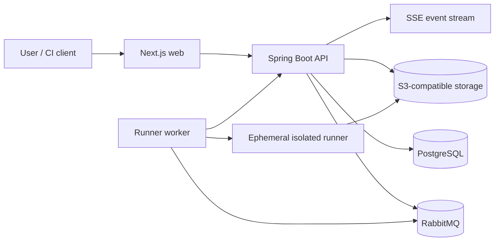

# KaaS — Karate as a Service

> **Execute. Automate. Assure.**

KaaS is a self-service quality engineering platform for executing Karate tests safely, asynchronously, and with structured results. This repository contains the architectural bootstrap for the product; it deliberately does **not** execute user-supplied tests in the control plane.

## Bootstrap status

See [IMPLEMENTATION_STATUS.md](IMPLEMENTATION_STATUS.md) for what is included, assumptions, commands, security concerns, and the next implementation slice.

## Architecture



The control plane owns identity, projects, configuration, orchestration, results, and artifact metadata. The execution plane owns only isolated test execution. The boundary is enforced by contracts and is a prerequisite for enabling arbitrary feature execution.

## Repository layout

- `apps/api` — Spring Boot control-plane API skeleton
- `apps/web` — Next.js frontend skeleton
- `services/runner` — execution-plane worker contract and safe bootstrap worker
- `packages/api-contracts` — versioned API and runner contract schemas
- `infrastructure/local` — local PostgreSQL, RabbitMQ, Redis, and MinIO configuration
- `docs` — product, architecture, security, and ADR documentation
- `.github/workflows` — CI validation

## Local development

Prerequisites: Java 21, Node.js 20+, Docker Compose, and Git.

```text
cp .env.example .env
docker compose -f infrastructure/local/docker-compose.yml up -d
```

The application commands are documented in `IMPLEMENTATION_STATUS.md`. The current environment does not include Java, Gradle, or Docker, so those validations must be run in a development environment with the prerequisites installed.

## Scope discipline

The MVP excludes repository integrations, scheduling, Kubernetes, multi-framework execution, billing, advanced RBAC, and AI generation. These are roadmap items, not partially implemented production paths.
