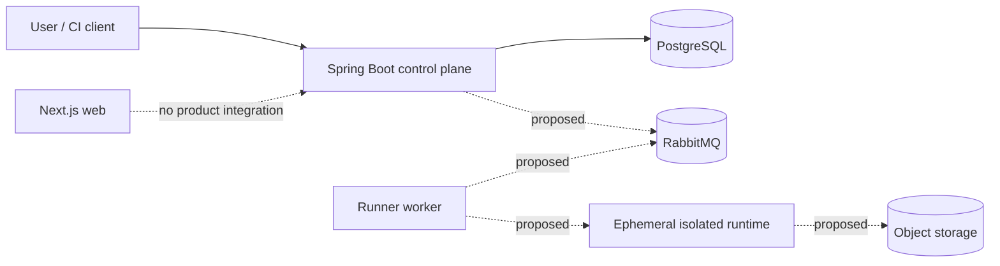

# KaaS — Karate as a Service

> **Execute. Automate. Assure.**

KaaS is intended to become a self-service quality engineering platform for isolated, asynchronous Karate execution and structured results. The repository implements authenticated, organization-scoped Projects, immutable FeatureRevisions, versioned execution configuration, TestRun intent with a sealed immutable execution snapshot, transactional CREATED to QUEUED scheduling, and an outbox relay that publishes queue-time dispatch intents to RabbitMQ with at-least-once semantics, publisher confirms, and database-owned retry. PostgreSQL remains the source of truth; RabbitMQ is transport.

Arbitrary test execution is disabled. No user-supplied feature runs in the API or runner scaffold.

## Capability status

| Capability | Status | Evidence / boundary |
|---|---|---|
| Java multi-module build | IMPLEMENTED + VALIDATED | Java 25, Gradle 9.7.1 wrapper, `./gradlew clean check` |
| Spring Boot control plane | IMPLEMENTED | JWT resource server, RFC 9457 errors, Project/FeatureRevision and versioned-configuration APIs, Flyway/JPA/JDBC/PostgreSQL |
| Project and immutable feature revisions | IMPLEMENTED + VALIDATED | Signed-JWT HTTP and PostgreSQL Testcontainers suite passed 13/13 in independent backend review; primary local daemon was unavailable |
| Environment and immutable revisions | IMPLEMENTED + VALIDATED | Typed scalar variables, metadata-only secret bindings, canonical digests, sealed relational aggregates, and 10-writer concurrency coverage |
| RunProfile and immutable revisions | IMPLEMENTED + VALIDATED | Exact EnvironmentRevision pinning, bounded execution intent, same-type plain overrides, canonical digests, and 10-writer concurrency coverage |
| SecretReference metadata | IMPLEMENTED + VALIDATED | Project-scoped identity/name/audit only; no value, provider/path, credential, resolve, reveal, or redemption capability |
| TestRun intent and immutable RunSnapshot | IMPLEMENTED + VALIDATED | 202 create, get/list/snapshot, semantic idempotency, exact initial dimensions, canonical digest, sealed V3 aggregate |
| Run scheduling, attempt, and outbox | IMPLEMENTED + VALIDATED | Internal CREATED to QUEUED compare-and-set, ExecutionAttempt #1, immutable queue-time DispatchIntent, sealed V4 aggregate, 10-scheduler concurrency coverage |
| Outbox relay and RabbitMQ publication | IMPLEMENTED + VALIDATED | Generalized typed outbox, database-owned retry/backoff, relay claim with SKIP LOCKED and lease expiry, publisher confirms, mandatory/unroutable handling, terminal dispositions, at-least-once with an explicit duplicate window; real RabbitMQ Testcontainers coverage |
| Production run scheduler | IMPLEMENTED + VALIDATED | Bounded, deterministically ordered batch invoking the established ScheduleRun use case; safe across replicas via compare-and-set |
| Tenant admission control | IMPLEMENTED + VALIDATED | Per-organization ceilings on active and queued runs, enforced under an advisory lock so concurrent creates cannot overshoot; 429 RUN_QUOTA_EXCEEDED; idempotent replay still succeeds at capacity |
| Durable scheduler backoff | IMPLEMENTED + VALIDATED | PostgreSQL-owned retry delay and quarantine that survive a restart and are shared across replicas; never mutates run lifecycle or version |
| Early run cancellation | IMPLEMENTED + VALIDATED | POST /runs/{runId}/cancellations ends a CREATED or QUEUED run immediately, idempotent by state, tenant-scoped with concealed 404; no STOPPING phase because no worker owns the run |
| Queue-deadline reaping | IMPLEMENTED + VALIDATED | The queue deadline is now enforced rather than merely recorded; an expired run is completed TIMED_OUT, never reported as cancelled, with durable backoff shared with the scheduler |
| Dispatch consumption and inbox | IMPLEMENTED + VALIDATED | Production RabbitMQ consumer with strict contract validation, durable inbox keyed by message identity, database-before-acknowledgement ordering, redelivery as a decided no-op, and integrity conflicts recorded rather than resolved |
| Worker claim and fencing | IMPLEMENTED + VALIDATED | QUEUED to CLAIMED compare-and-set corroborated against the persisted dispatch, assignment epoch as fencing token, server-controlled worker identity and lease; grants no execution, source, or secret authority |
| Lease recovery | IMPLEMENTED + VALIDATED | Heartbeats on an internal service surface, expiry plus recovery window, fencing to STOPPING, and settlement to FAILED/LEASE_LOST so claimed work always releases capacity |
| Dispatch suppression | IMPLEMENTED + VALIDATED | A dispatch no relay is currently holding is withdrawn in the terminating transaction, spending no attempt and counting as no dead letter; a message under a live relay lease is left to publish rather than falsely recalled |
| Migration-upgrade testing | IMPLEMENTED + VALIDATED | Every migration verified against an empty database and against a populated previous-version database with its triggers installed, with the fixture proven to reach what the upgrade changes before it runs |
| Runner bootstrap | SCAFFOLDED + VALIDATED | Reports that execution is disabled; launches no external process |
| Next.js web scaffold | IMPLEMENTED + VALIDATED | Next.js 16.3.3; lint, typecheck, render test, build, production audit |
| Contract tooling | IMPLEMENTED + VALIDATED | Strict AJV schemas/fixtures plus semantic checks; proposed contracts only |
| OpenAPI contract | IMPLEMENTED + PROPOSED | Run create/get/list/snapshot/cancellations and configuration APIs are implemented; events/results/artifacts remain proposed. The worker heartbeat is an internal service operation and is deliberately outside the public contract |
| Local PostgreSQL/RabbitMQ/MinIO definitions | SCAFFOLDED | Loopback-only Compose config with development health checks |
| Modular control-plane boundaries | IMPLEMENTED | Capability packages with inward ports and ArchUnit enforcement |
| PostgreSQL persistence | IMPLEMENTED | Flyway schema, JPA validation, tenant composite FKs, immutable-revision trigger, query indexes |
| RabbitMQ, SSE, object storage integration | PLANNED | No publisher, consumer, stream, or storage adapter exists |
| Docker execution sandbox | DESIGNED, NOT APPROVED | ADR-006 is proposed; no launcher or runner image exists |
| Authentication and product APIs | IMPLEMENTED FOR CURRENT SLICES | External OIDC-compatible bearer JWT; trusted tenant claims only; full-parent scoping and cross-tenant concealment |
| Run lifecycle/results/messaging/SSE semantics | DESIGNED + VALIDATED | Proposed ADRs, canonical docs, strict schemas, fixtures, and OpenAPI; no runtime adapters |
| Karate execution | PLANNED + DISABLED | No dependency, launcher, consumer, or arbitrary execution path |

Status meanings: **IMPLEMENTED** is present in code/tooling; **VALIDATED** has an automated passing check; **SCAFFOLDED** has only a minimal executable or contract shell; **DESIGNED** is documented intent; **PLANNED** has no active implementation.

## Proposed product architecture



The diagram is a target, not a deployment claim. The control plane must never execute user-controlled test content. Execution remains disabled until a separate security architecture review approves and verifies the launcher, runtime, network, secret, resource, and artifact controls.

## Repository layout

- `apps/api` — JWT-secured Project/FeatureRevision, versioned-configuration, TestRun/snapshot, scheduling/outbox control plane, and the RabbitMQ outbox relay
- `apps/web` — Next.js frontend scaffold and render test
- `services/runner` — non-executing runner bootstrap
- `packages/api-contracts` — JSON Schemas, fixtures, and OpenAPI validation tooling
- `infrastructure/local` — loopback-only local dependency definitions
- `docs` — product intent, proposed architecture, security requirements, and ADRs
- `.github/workflows` — foundation verification

## Toolchain

- Java 25
- Gradle 9.7.1 through the committed wrapper; no global Gradle installation
- Spring Boot 4.1.1
- Node.js 24 LTS
- Next.js 16.3.3 / React 19.2.8
- Docker Compose

Stable supported releases are preferred. Preview, milestone, release-candidate, and nightly versions are not selected merely because their version number is higher.

## Verify the repository

```text
./gradlew clean check
npm --prefix apps/web ci
npm --prefix apps/web run lint
npm --prefix apps/web run typecheck
npm --prefix apps/web test
npm --prefix apps/web run build
npm --prefix apps/web audit --omit=dev
npm --prefix packages/api-contracts ci
npm --prefix packages/api-contracts test
docker compose -f infrastructure/local/docker-compose.yml config
git diff --check
```

## Local API and infrastructure

The API connects to the Compose PostgreSQL defaults through `KAAS_DATABASE_*`. RabbitMQ and MinIO remain present but are intentionally not wired into this slice. Product endpoints also need a trusted issuer, JWK set, and audience; the checked-in non-routable OIDC defaults fail closed. Defaults bind infrastructure ports to `127.0.0.1`.

```text
cp .env.example .env
docker compose -f infrastructure/local/docker-compose.yml config
docker compose -f infrastructure/local/docker-compose.yml up -d
KAAS_OIDC_ISSUER_URI=https://issuer.example \
KAAS_OIDC_JWK_SET_URI=https://issuer.example/.well-known/jwks.json \
KAAS_OIDC_AUDIENCE=kaas-api \
./gradlew :apps:api:bootRun
```

The checked-in values are local-development defaults, not production secret management.

## Documentation

- [Implementation status](IMPLEMENTATION_STATUS.md)
- [Independent architecture review](CODEX_ARCHITECTURE_REVIEW.md)
- [Foundation repair report](FOUNDATION_REPAIR_REPORT.md)
- [Contract and lifecycle architecture report](CONTRACT_LIFECYCLE_ARCHITECTURE_REPORT.md)
- [Project/Feature slice report](PROJECT_FEATURE_SLICE_REPORT.md)
- [Environment/RunProfile slice report](ENVIRONMENT_RUN_PROFILE_SLICE_REPORT.md)
- [Implemented Project/Feature architecture](docs/architecture/project-feature-slice.md)
- [Implemented Environment/RunProfile architecture](docs/architecture/environment-run-profile-slice.md)
- [Implemented TestRun intent/snapshot architecture](docs/architecture/test-run-intent-slice.md)
- [Implemented scheduling/attempt/outbox architecture](docs/architecture/scheduling-outbox-slice.md)
- [Scheduling/outbox slice report](SCHEDULING_OUTBOX_SLICE_REPORT.md)
- [Implemented outbox relay/RabbitMQ architecture](docs/architecture/outbox-relay-rabbitmq-slice.md)
- [Outbox relay/RabbitMQ slice report](RABBITMQ_OUTBOX_RELAY_SLICE_REPORT.md)
- [Implemented admission/scheduler hardening](docs/architecture/admission-scheduler-hardening.md)
- [Admission/scheduler hardening report](ADMISSION_SCHEDULER_HARDENING_REPORT.md)
- [Implemented early terminal lifecycle](docs/architecture/early-terminal-lifecycle-slice.md)
- [Early terminal lifecycle slice report](EARLY_TERMINAL_LIFECYCLE_SLICE_REPORT.md)
- [Implemented consumer/claim/lease architecture](docs/architecture/consumer-claim-lease-slice.md)
- [Consumer/claim/lease slice report](CONSUMER_CLAIM_LEASE_SLICE_REPORT.md)
- [Architecture decisions](docs/adr/README.md)
- [Security release requirements](docs/security/threat-model.md)

## Scope discipline

This slice lets published work be received and authoritatively claimed, and gives claimed work a bounded way back out. It deliberately does not implement ExecutionCommand production, source capability issuance, secret capability issuance, provisioning, SSE, secret values/storage/redemption, source bundles, object storage, Karate parsing/execution, a container launcher, network enforcement, results/artifacts, quality-gate execution, or full OpenTelemetry infrastructure. A claim records who owns an infrastructure attempt and grants no permission to execute anything; that boundary is the point.
