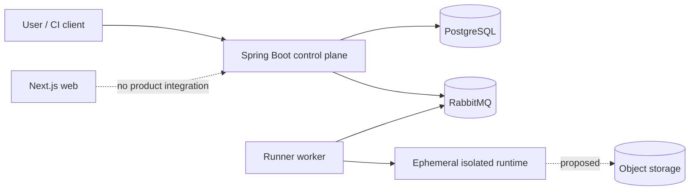

# KaaS — Karate as a Service

> **Execute. Automate. Assure.**

KaaS is intended to become a self-service quality engineering platform for isolated, asynchronous Karate execution and structured results. The repository implements authenticated, organization-scoped Projects, immutable FeatureRevisions, versioned execution configuration, TestRun intent with a sealed immutable execution snapshot, transactional CREATED to QUEUED scheduling, and an outbox relay that publishes queue-time dispatch intents to RabbitMQ with at-least-once semantics, publisher confirms, and database-owned retry. PostgreSQL remains the source of truth; RabbitMQ is transport.

Tenant Karate features execute inside a mediated (gVisor) sandbox — secret-free since ADR-033 and with tenant secrets since ADR-034. Nothing runs in the API process, and nothing a tenant supplies becomes a command line, an image, a flag or a classpath entry. The execution loop is proven in CI; a deployable runner daemon and the Operations infrastructure are the next slice.

## Capability status

| Capability | Status | Evidence / boundary |
|---|---|---|
| Java multi-module build | IMPLEMENTED + VALIDATED | Java 25, Gradle 9.7.1 wrapper, `./gradlew clean check` |
| Spring Boot control plane | IMPLEMENTED | JWT resource server, RFC 9457 errors, Project/FeatureRevision and versioned-configuration APIs, Flyway/JPA/JDBC/PostgreSQL |
| Project and immutable feature revisions | IMPLEMENTED + VALIDATED | Signed-JWT HTTP and PostgreSQL Testcontainers suite passed 13/13 in independent backend review; primary local daemon was unavailable |
| Environment and immutable revisions | IMPLEMENTED + VALIDATED | Typed scalar variables, secret bindings to references (never values), canonical digests, sealed relational aggregates, and 10-writer concurrency coverage |
| RunProfile and immutable revisions | IMPLEMENTED + VALIDATED | Exact EnvironmentRevision pinning, bounded execution intent, same-type plain overrides, canonical digests, and 10-writer concurrency coverage |
| SecretReference and SecretVersions | IMPLEMENTED + VALIDATED | Project-scoped identity; immutable versions written as octet-stream, encrypted with Vault Transit under a key derived for the organization and project, stored only as ciphertext, revocable with the ciphertext destroyed. No API reveals a value (ADR-034) |
| TestRun intent and immutable RunSnapshot | IMPLEMENTED + VALIDATED | 202 create, get/list/snapshot, semantic idempotency, exact initial dimensions, canonical digest, sealed V3 aggregate |
| Run scheduling, attempt, and outbox | IMPLEMENTED + VALIDATED | Internal CREATED to QUEUED compare-and-set, ExecutionAttempt #1, immutable queue-time DispatchIntent, sealed V4 aggregate, 10-scheduler concurrency coverage |
| Outbox relay and RabbitMQ publication | IMPLEMENTED + VALIDATED | Generalized typed outbox, database-owned retry/backoff, relay claim with SKIP LOCKED and lease expiry, publisher confirms, mandatory/unroutable handling, terminal dispositions, at-least-once with an explicit duplicate window; real RabbitMQ Testcontainers coverage |
| Production run scheduler | IMPLEMENTED + VALIDATED | Bounded, deterministically ordered batch invoking the established ScheduleRun use case; safe across replicas via compare-and-set |
| Tenant admission control | IMPLEMENTED + VALIDATED | Per-organization ceilings on active and queued runs, enforced under an advisory lock so concurrent creates cannot overshoot; 429 RUN_QUOTA_EXCEEDED; idempotent replay still succeeds at capacity |
| Durable scheduler backoff | IMPLEMENTED + VALIDATED | PostgreSQL-owned retry delay and quarantine that survive a restart and are shared across replicas; never mutates run lifecycle or version |
| Early run cancellation | IMPLEMENTED + VALIDATED | POST /runs/{runId}/cancellations ends a CREATED or QUEUED run immediately, idempotent by state, tenant-scoped with concealed 404; no STOPPING phase because no worker owns the run |
| Queue-deadline reaping | IMPLEMENTED + VALIDATED | The queue deadline is now enforced rather than merely recorded; an expired run is completed TIMED_OUT, never reported as cancelled, with durable backoff shared with the scheduler |
| Dispatch consumption and inbox | IMPLEMENTED + VALIDATED | Production RabbitMQ consumer with strict contract validation, durable inbox keyed by message identity, database-before-acknowledgement ordering, redelivery as a decided no-op, and integrity conflicts recorded rather than resolved |
| Worker claim and fencing | IMPLEMENTED + VALIDATED | QUEUED to CLAIMED compare-and-set corroborated against the persisted dispatch, assignment epoch as fencing token, server-controlled worker identity and lease; grants no execution, source, or secret authority |
| Lease recovery | IMPLEMENTED + VALIDATED | Heartbeats on an internal service surface, expiry plus recovery window, fencing to STOPPING, and settlement to FAILED/LEASE_LOST so claimed work always releases capacity |
| Dispatch suppression | IMPLEMENTED + VALIDATED | A dispatch no relay is currently holding is withdrawn in the terminating transaction, spending no attempt and counting as no dead letter; a message under a live relay lease is left to publish rather than falsely recalled |
| Migration-upgrade testing | IMPLEMENTED + VALIDATED | Every migration verified against an empty database and against a populated previous-version database with its triggers installed, with the fixture proven to reach what the upgrade changes before it runs |
| Runner execution loop | IMPLEMENTED + VALIDATED IN CI | Drives the full execution lifecycle over the internal API, including Karate with secrets. Composed by tests and CI only: `RunnerApplication` does not yet start it, so a production runner daemon is the next slice |
| Next.js web scaffold | IMPLEMENTED + VALIDATED | Next.js 16.3.3; lint, typecheck, render test, build, production audit |
| Contract tooling | IMPLEMENTED + VALIDATED | Strict AJV schemas/fixtures plus semantic checks; proposed contracts only |
| OpenAPI contract | IMPLEMENTED + PROPOSED | Run create/get/list/snapshot/cancellations and configuration APIs are implemented; events/results/artifacts remain proposed. The worker heartbeat is an internal service operation and is deliberately outside the public contract |
| Local PostgreSQL/RabbitMQ/MinIO definitions | SCAFFOLDED | Loopback-only Compose config with development health checks |
| Modular control-plane boundaries | IMPLEMENTED | Capability packages with inward ports and ArchUnit enforcement |
| PostgreSQL persistence | IMPLEMENTED | Flyway schema, JPA validation, tenant composite FKs, immutable-revision trigger, query indexes |
| SSE and object storage integration | PLANNED | No stream or storage adapter exists. RabbitMQ publication and consumption are implemented, as the two rows above record |
| Hostile-execution sandbox | IMPLEMENTED + VALIDATED FOR TENANT CODE UNDER THE MEDIATED RUNTIME | ADR-022's runtime prerequisite was closed by ADR-032 for gVisor. Shared-kernel Docker remains **not approved** for tenant code; no caller-supplied command can enter a sandbox |
| Hostile-content boundary | ADJUDICATED (ADR-022 → ADR-032) | Tenant bytes became executable under ADR-032/033 and may carry secrets under ADR-034. Residual risks are in [the readiness matrix](docs/security/execution-readiness-matrix.md) |
| Continuous execution authority | IMPLEMENTED + VALIDATED | A worker maintains evidence it still owns its assignment for every phase it owns, and acts on the answer (ADR-029). Cancellation, fencing or an expired lease **stops the running sandbox** — measured at 10.2 seconds end to end — and an unreachable control plane consumes the remaining lease budget and then stops it fail-closed. Database fencing stops a stale worker writing; this stops it running, and both are required |
| Mediating sandbox runtime | IMPLEMENTED + VALIDATED IN CI | The sandbox runs under gVisor with **no fallback to the baseline** — not a flag, not a catch block (ADR-028). Requested and enforced are separately observable: the daemon's assigned runtime is read back before the workload starts, and the guest kernel names itself from inside. The mandatory control set is scoped to the runtime, and the mediating one carries **one fewer demonstrable control** than the baseline because gVisor exposes no `NoNewPrivs` flag. Evidence exists only in the mandatory `strong-runtime-gate` job: the runtime cannot be installed on macOS, so a green local build proves nothing about it |
| Authentication and product APIs | IMPLEMENTED FOR CURRENT SLICES | External OIDC-compatible bearer JWT; trusted tenant claims only; full-parent scoping and cross-tenant concealment |
| SSE and artifact semantics | DESIGNED + VALIDATED | Proposed ADRs, canonical docs, strict schemas, fixtures, and OpenAPI; no runtime adapters |
| Synthetic execution lifecycle | IMPLEMENTED + VALIDATED | CLAIMED through PROVISIONING, RUNNING, COLLECTING_RESULTS, and PROCESSING_RESULTS to COMPLETED, driven by a real worker over the internal API, with per-phase deadlines, a reconciler that stops and fences overdue runs, and result provenance checked against authoritative state (ADR-024). A worker renews its lease for the whole of execution, so a run may outlive one lease period. Proven end to end on a real database, a real container runtime, and a real sandbox |
| Karate execution | IMPLEMENTED + VALIDATED IN CI | Karate 2.1.2 in its own module, on a delivered and frozen source filesystem, under the mediating runtime only (ADR-033); with secrets through `kaas.secrets.<KEY>` and through the egress proxy under an allowlist (ADR-034). The runner enforces the engine identity itself |
| Secret execution and redaction | IMPLEMENTED + VALIDATED IN CI | Pinned versions, one assignment-scoped capability for exactly the pinned set, delivery after the freeze, `LogConfig=none` with live capture, and exact-value redaction before the output ceiling. Transformed values are not detected (ADR-034, [redaction boundary](docs/security/secret-redaction-boundary.md)) |
| Sandbox security attestation | **IMPLEMENTED + VALIDATED** | Signed by the gate that made the observations and verified against a deployment-pinned Ed25519 key (ADR-027). An operator transports the artifact and no longer authors its verdicts; the control plane holds verification authority and structurally cannot sign. `v5` required (ADR-032 bound the runtime binary's identity); v4, v3 and unsigned v2 refused with no fallback |
| Execution egress | IMPLEMENTED + VALIDATED | `DENY_ALL` keeps the proven network-disabled path. `ALLOWLIST` is enforceable for trusted synthetic execution (ADR-026): the sandbox joins one per-execution `--internal` network whose only other member is a trusted proxy, so the no-bypass property is topological rather than configured. `ALLOWLIST` is still refused — never downgraded — unless the deployment's own assessment demonstrates it can enforce it |
| Execution authorization | IMPLEMENTED | Owning an attempt is not permission to execute it: a separate assignment-scoped decision, bounded by the lease, revalidated on every capability redemption |
| Source capability | IMPLEMENTED | Short-lived assignment-scoped bearer token for the snapshot-pinned feature sources; plaintext never stored |
| Secret capability | IMPLEMENTED | Issued for every secret-bearing authorization, scoped to exactly the pinned (key, reference, version) set, redeemable twice, revalidated before and after decryption; none for a secret-free run (ADR-034) |
| Network policy | IMPLEMENTED | Platform-owned immutable revisions, snapshot-pinned at run creation. An `ALLOWLIST` names exact host, port, and scheme; wildcards, CIDRs, and IP literals are refused rather than accepted and never matched |

Status meanings: **IMPLEMENTED** is present in code/tooling; **VALIDATED** has an automated passing check; **SCAFFOLDED** has only a minimal executable or contract shell; **DESIGNED** is documented intent; **PLANNED** has no active implementation.

## Proposed product architecture


```mermaid
flowchart LR
  User["User / CI client"] --> API["Spring Boot control plane"]
  Web["Next.js web"] -. no product integration .-> API
  API --> DB[(PostgreSQL)]
  API --> Queue[(RabbitMQ)]
  Worker["Runner worker"] --> Queue
  Worker --> Sandbox["Ephemeral isolated runtime"]
  Sandbox -. proposed .-> Objects[(Object storage)]
```

Solid edges are implemented and covered by tests; the dotted edge is not built. Publication, consumption, claim, lease, execution authorization, and the synthetic execution lifecycle all exist — see [ADR-021](docs/adr/021-durable-dispatch-consumption-fencing-and-worker-lease.md), [ADR-023](docs/adr/023-execution-authorization-and-assignment-scoped-capabilities.md), and [ADR-024](docs/adr/024-synthetic-execution-lifecycle.md).

**What the sandbox runs is a platform-owned synthetic workload, not tenant content.** The control plane never executes user-controlled test content, and execution of user content remains disabled. A mediating runtime now exists ([ADR-028](docs/adr/028-mediated-sandbox-runtime.md)), which was ADR-022's named prerequisite — and ADR-022 is deliberately **not** closed by it: a stronger runtime starting is not the same as hostile tenant content being safe to run, the mediating runtime demonstrates one fewer mandatory control than the baseline, and its sentry is still a userspace process on the host kernel. Egress is now enforceable ([ADR-026](docs/adr/026-enforceable-assignment-scoped-execution-egress.md)) and is no longer what blocks it — but what an allowlist authorizes today is that same platform-owned workload reaching a destination an operator wrote down, so nothing about it moves the boundary on tenant code.

## Repository layout

- `apps/api` — JWT-secured Project/FeatureRevision, versioned-configuration, TestRun/snapshot, scheduling/outbox control plane, and the RabbitMQ outbox relay
- `apps/web` — Next.js frontend scaffold and render test
- `services/runner` — runner bootstrap plus the trusted sandbox launcher and security gate; executes the synthetic probe only, never user content
- `packages/api-contracts` — JSON Schemas, fixtures, and OpenAPI validation tooling
- `infrastructure/local` — loopback-only local dependency definitions
- `docs` — product intent, proposed architecture, security requirements, and ADRs
- `.github/workflows` — foundation verification

## Toolchain

- Java 25
- Gradle 9.7.1 through the committed wrapper; no global Gradle installation
- Spring Boot 4.1.1
- Node.js 24 LTS
- Next.js 16.3.3 / React 19.2.8
- Docker Compose

Stable supported releases are preferred. Preview, milestone, release-candidate, and nightly versions are not selected merely because their version number is higher.

## Verify the repository

```text
./gradlew clean check
npm --prefix apps/web ci
npm --prefix apps/web run lint
npm --prefix apps/web run typecheck
npm --prefix apps/web test
npm --prefix apps/web run build
npm --prefix apps/web audit --omit=dev
npm --prefix packages/api-contracts ci
npm --prefix packages/api-contracts test
docker compose -f infrastructure/local/docker-compose.yml config
git diff --check
```

## Local API and infrastructure

The API connects to the Compose PostgreSQL defaults through `KAAS_DATABASE_*`. RabbitMQ and MinIO remain present but are intentionally not wired into this slice. Product endpoints also need a trusted issuer, JWK set, and audience; the checked-in non-routable OIDC defaults fail closed. Defaults bind infrastructure ports to `127.0.0.1`.

```text
cp .env.example .env
docker compose -f infrastructure/local/docker-compose.yml config
docker compose -f infrastructure/local/docker-compose.yml up -d
KAAS_OIDC_ISSUER_URI=https://issuer.example \
KAAS_OIDC_JWK_SET_URI=https://issuer.example/.well-known/jwks.json \
KAAS_OIDC_AUDIENCE=kaas-api \
./gradlew :apps:api:bootRun
```

The checked-in values are local-development defaults, not production secret management.

## Documentation

- [Implementation status](IMPLEMENTATION_STATUS.md)
- [Independent architecture review](CODEX_ARCHITECTURE_REVIEW.md)
- [Foundation repair report](FOUNDATION_REPAIR_REPORT.md)
- [Contract and lifecycle architecture report](CONTRACT_LIFECYCLE_ARCHITECTURE_REPORT.md)
- [Project/Feature slice report](PROJECT_FEATURE_SLICE_REPORT.md)
- [Environment/RunProfile slice report](ENVIRONMENT_RUN_PROFILE_SLICE_REPORT.md)
- [Implemented Project/Feature architecture](docs/architecture/project-feature-slice.md)
- [Implemented Environment/RunProfile architecture](docs/architecture/environment-run-profile-slice.md)
- [Implemented TestRun intent/snapshot architecture](docs/architecture/test-run-intent-slice.md)
- [Implemented scheduling/attempt/outbox architecture](docs/architecture/scheduling-outbox-slice.md)
- [Scheduling/outbox slice report](SCHEDULING_OUTBOX_SLICE_REPORT.md)
- [Implemented outbox relay/RabbitMQ architecture](docs/architecture/outbox-relay-rabbitmq-slice.md)
- [Outbox relay/RabbitMQ slice report](RABBITMQ_OUTBOX_RELAY_SLICE_REPORT.md)
- [Implemented admission/scheduler hardening](docs/architecture/admission-scheduler-hardening.md)
- [Admission/scheduler hardening report](ADMISSION_SCHEDULER_HARDENING_REPORT.md)
- [Implemented early terminal lifecycle](docs/architecture/early-terminal-lifecycle-slice.md)
- [Early terminal lifecycle slice report](EARLY_TERMINAL_LIFECYCLE_SLICE_REPORT.md)
- [Implemented consumer/claim/lease architecture](docs/architecture/consumer-claim-lease-slice.md)
- [Consumer/claim/lease slice report](CONSUMER_CLAIM_LEASE_SLICE_REPORT.md)
- [Implemented enforceable execution egress](docs/architecture/enforceable-execution-egress.md)
- [Execution egress slice report](EXECUTION_EGRESS_SLICE_REPORT.md)
- [Execution egress policy](docs/security/execution-egress-policy.md)
- [Implemented signed sandbox security attestation](docs/architecture/signed-sandbox-security-attestation.md)
- [Signed runtime attestation](docs/security/signed-runtime-attestation.md)
- [Running the sandbox under a mediating runtime](docs/security/mediated-sandbox-runtime.md)
- [Continuous execution authority](docs/architecture/continuous-execution-authority.md)
- [Hostile-content readiness](docs/security/hostile-content-readiness.md)
- [The hostile-content boundary, composed](docs/architecture/hostile-content-boundary.md)
- [Hostile runtime candidate evaluation](docs/architecture/hostile-runtime-evaluation.md)
- [Signed security attestation slice report](SIGNED_SECURITY_ATTESTATION_SLICE_REPORT.md)
- [Architecture decisions](docs/adr/README.md)
- [Security release requirements](docs/security/threat-model.md)

## Scope discipline

The current slice (KAAS-22, ADR-034) adds secret-bearing Karate execution: Vault Transit envelope encryption with ciphertext in PostgreSQL, immutable pinned versions, assignment-scoped secret capabilities, runtime-only delivery after the source freeze, and trusted exact-value redaction with no Docker log store for tenant code.

It deliberately does not implement: a production runner daemon or any deployment infrastructure (Vault operations, WireGuard, the execution host), persisted tenant output or reports, structured Karate results, artifacts, SSE, quality-gate execution, semantic DLP, or full OpenTelemetry. Application capability is not deployment readiness.
