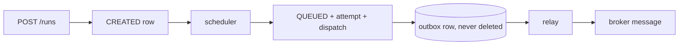

# Implemented tenant admission and durable scheduler hardening

**Status: IMPLEMENTED CONTROL-PLANE SLICE.** Bounds tenant amplification and makes scheduler retry survive a restart. Adds no consumer, no worker claim, and no execution.

## Why this exists

Run creation used to be inert. Since the relay slice it is not:



Every one of those is durable, and none of it was bounded. One authenticated tenant could turn request volume into storage and broker load for the whole platform.

## Two ceilings, two prices

| Ceiling | Gates | What a unit costs |
|---|---|---|
| `max-active-runs-per-organization` | `POST /runs` | one `test_runs` row plus its sealed snapshot |
| `max-queued-runs-per-organization` | `CREATED → QUEUED` | an attempt, a dispatch, a permanent outbox row, and a broker message |

Active means every state that is not complete. Naming the two states that exist today would make the ceiling stop binding the instant `QUEUED → CLAIMED` lands — and because the partial index carries the same predicate, fixing it later would need another migration.

Splitting them matters. Holding intent is nearly free, so a burst is accepted and simply waits; converting intent into queued work is expensive, so that is where the burst is throttled. A single combined ceiling would refuse cheap requests at the API for an expense they had not yet incurred.

Both limits are server configuration, validated at startup, and no request body, header, or token claim can influence either.

## Admission is decisive because it is serialized

```
BEGIN
  advisory lock (per-key idempotency)   -- pre-existing
  resolve replay -> return early
  read revisions, materialise snapshot  -- read-only and pure, deliberately outside the lock
  advisory lock (organization)          -- always second, so the two can never deadlock
  count runs that are not complete
  over capacity?  -> 429 RUN_QUOTA_EXCEEDED, nothing written
  otherwise       -> create TestRun + sealed RunSnapshot + idempotency record
COMMIT
```

The organization lock is taken as late as possible. Only the count and the write need mutual exclusion, and every request waiting on the lock holds a pooled connection — so a long critical section would let one busy tenant exhaust the pool and stall reads for everyone else.

Without the lock this is theatre: twenty concurrent requests each read the same pre-insert count, all pass, and the organization overshoots by nineteen. The lock is what makes the count a decision rather than an observation.

No counter table was added. There is no counter to keep consistent, and `ix_test_runs_admission` — a partial index on `(organization_id, lifecycle_state)` restricted to runs that are not complete — answers both counts with an index-only scan whose cost tracks active runs rather than total history, verified against 800k completed runs.

The 429 states no counts, no capacity, no other tenant's usage, and carries no `Retry-After`, because capacity frees when the organization's own runs complete and no honest duration exists.

## An idempotent replay is not new work

Replay is resolved **before** admission. A replay that already succeeded returns its original run even at capacity: it creates nothing, and refusing it would punish a client for retrying safely — the exact behaviour idempotency exists to make free.

A new key is new work and obeys the current ceiling. Both directions are tested.

## The queue ceiling defers rather than fails

When an organization is at its queued ceiling the run stays `CREATED` and gets a durable next-attempt time. That is not a failure: it accrues no failure count and can never lead to quarantine. The database enforces this — a control row may only carry a quarantine once it has at least one real failure.

## Durable scheduler backoff

```
                     ┌──────────────► scheduled ──► control row DELETED
                     │
CREATED ──► eligible ┼──► transient failure ──► delay grows, bounded ──┐
                     │                                                  │
                     ├──► queue full ──► deferred (no failure counted)  │
                     │                                                  ▼
                     └──◄ next_attempt_at elapses            quarantined (operator clears)
```

`run_scheduling_control` holds `failure_count`, `next_attempt_at`, `last_attempt_at`, `last_failure_code`, and `quarantined_at`. Selection is a left join: a run is eligible when it has no control row at all, or when its row is neither quarantined nor still serving a delay. Selection also skips organizations already at their queue ceiling and round-robins across the rest, so one tenant's backlog cannot occupy the batch window.

The delay, the failure count, and the quarantine decision are all derived by the single statement that records the attempt. Reading the clock or the count first would mean the failure path needs a database round trip before it can record a failure — so a partial outage would write no backoff at all and leave the run instantly eligible, which is the hot loop this table exists to prevent.

It is a **separate table, not columns on `test_runs`**. Scheduling is technical state; putting it on the aggregate would mean permitting a second class of mutation and weakening the guard that makes `CREATED → QUEUED` the only permitted transition. Nothing in this slice touches a run's lifecycle or version.

Success deletes the control row. Absence is the single representation of "nothing is holding this run back", so no stale eligibility can outlive the transition it was gating.

## A scheduling failure is not a run outcome

| Condition | Behaviour |
|---|---|
| queue at ceiling | deferred; no failure counted, never quarantined |
| transient (database or internal error) | escalating bounded delay, capped, jittered |
| trusted input that cannot be valid | quarantined immediately; retrying is guaranteed waste |
| budget spent | quarantined |

In every case the run stays `CREATED` with no test outcome and no infrastructure outcome. Infrastructure being briefly unhealthy says nothing about a test run, so this slice invents no terminal lifecycle transition.

**Operator recovery:** delete the run's row from `run_scheduling_control`. The run becomes immediately eligible again and nothing about it needed repairing. There is deliberately no endpoint — reviving a poisoned run is a decision, and the failure modes are still being learned.

## Migration-upgrade testing

A fresh-schema migration test is not a migration test. A backfill over zero rows cannot trip a guard, violate a constraint, or leave a NULL behind, so an empty database is silent about exactly the failures that matter — which is how the previous slice shipped a migration that was rejected by its predecessor's own trigger.

Every migration is now verified in both directions:

| Direction | What it proves |
|---|---|
| empty → current | the chain applies and nothing is left pending |
| previous version + representative rows → current | a migration can transform rows the previous version's triggers were protecting |

The populated fixture seeds a project, feature, environment and profile revisions, a `CREATED` run, and four `QUEUED` runs each with a complete scheduling bundle and one **dispatch-backed** outbox row, covering all four delivery states. It seeds under `session_replication_role = replica` on a single connection, then restores it, so the migration under test runs with every guard installed.

The rows being dispatch-backed is the point, and the first version of this fixture got it wrong. Seeding rows with a null `dispatch_id` meant a backfill that joins or filters on the dispatch would match nothing and pass green — reproducing the exact blind spot the gate exists to close. The gate is verified with a probe in that real shape:

```sql
UPDATE outbox_messages o SET last_failure_code = 'PROBE'
  FROM execution_dispatches d
 WHERE d.dispatch_id = o.dispatch_id AND o.message_type = 'EXECUTION_DISPATCH';
```

The populated test fails with the trigger's SQLSTATE; the fresh test still passes.

**Known limits of this gate.** It baselines at the previous version only, so two migrations in one slice leave the earlier one tested against an empty database. It cannot detect an edited historical migration, because checksums are derived from the same files it just applied. Its assertions are structural, so a migration that silently rewrote data would pass. And eleven tables are still unseeded — the fixture has to grow with the schema.

## Observability

`kaas.run.admission.rejected`, `kaas.scheduler.deferred`, `kaas.scheduler.failures`, and the `kaas.scheduler.quarantined` gauge. Dimensioned by reason category only — never organization, project, run, principal, or message identity. Logs carry trusted resource identifiers and bounded reason codes, never request bodies or configuration.

## Constraints the worker-claim slice must still rewrite

Unchanged and deliberately not weakened: `require_complete_scheduling_bundle`, `guard_initial_execution_attempt`, `ck_run_lifecycle_events_schedule`, and the single-attempt uniqueness and check constraints. They must be rewritten together.
