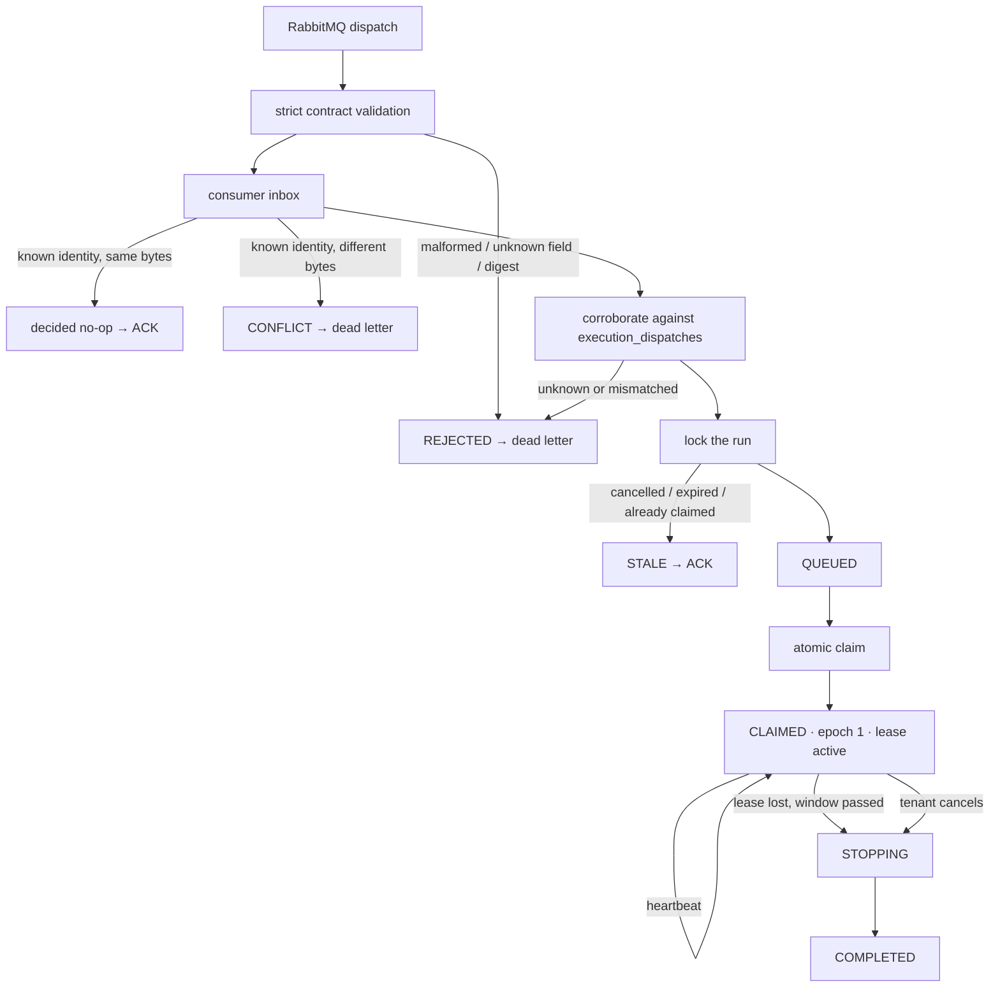

# Implemented dispatch consumption, worker claim, and lease

**Status: IMPLEMENTED CONTROL-PLANE SLICE.** Published work can now be received and authoritatively claimed, and claimed work has a bounded way back out. Grants no authority to execute anything.

## Why this exists

The relay slice put dispatch intents on a broker that nothing consumed. This slice makes them arrive — which is the first time the control plane reads bytes it did not author and has to decide what they are allowed to cause.



Explicitly **not** here: no source capability, no secret capability, no ExecutionCommand, no Karate, no container. An ArchUnit rule fails the build if the claim path ever reaches a runner, an object store, a container launcher, or a secret provider.

## A message is transport, not authority

Every delivery is untrusted input until the control plane's own records agree with it.

| Check | What it rules out |
|---|---|
| size before parsing | a body large enough to hurt the parser |
| strict UTF-8 | replacement characters silently entering a digest-bound document |
| unknown properties rejected | fields the digest does not cover riding along to a more trusting reader |
| semantic digest re-derived | any edit to any field the contract declares |
| identity looked up in `execution_dispatches` | a well-formed message this control plane never produced |
| every field compared to that row | cross-tenant and cross-project substitution |
| run read under a lock, compare-and-set | acting on state that moved while the message was in flight |

Transport headers can only ever cause a **rejection**. The same values are checked against the body, the digest covers the body alone, and a header that disagrees with the body is a reason to disbelieve the message rather than to prefer the header.

The worker identity is server-controlled configuration. It is never read from the message, and it is audit rather than authorization: it records which instance the assignment was handed to, not what that instance may do.

## The database commits before the broker is acknowledged

```
broker delivery
      ↓
BEGIN  →  lock message identity
          inbox lookup
          corroborate dispatch
          lock run + attempt
          compare-and-set QUEUED → CLAIMED
          bind epoch, worker, lease
          lifecycle event
          record inbox decision
COMMIT
      ↓
broker ACK
```

Acknowledging first would lose work on any process death between the two, with the broker believing it was handled. Committing first turns the same death into a redelivery — which the inbox absorbs.

## The inbox

Keyed by `(consumer, messageId)`. Never by delivery tag: that is channel-local transport metadata that changes on every redelivery and means nothing across connections. The broker's `redelivered` flag is a hint, not truth.

| Situation | Recorded |
|---|---|
| valid, run claimable | `CLAIMED` |
| valid, run cancelled / expired / already claimed | `STALE` |
| malformed, unsupported, digest mismatch, unknown dispatch | `REJECTED` |
| known identity, different bytes | `CONFLICT` |
| known identity, same bytes | nothing new — `delivery_count` increments |

**`DUPLICATE` is deliberately not a disposition.** A message's fate does not change when the broker offers it again, only the number of times it has been offered. Recording a second decision would mean the inbox held two answers to one question.

Retention is bounded but not implemented. Rows must outlive the broker's maximum plausible redelivery window, because deleting one turns the next redelivery back into an undecided message. Nothing prunes the table yet, and it is not claimed that infinite retention is required.

## Requeue versus rejection

| Cause | Broker | Why |
|---|---|---|
| our failure — database unreachable, internal error | requeue, after a pause | the work is real; losing it is worse than retrying |
| the message is wrong — malformed, unsupported, conflicting | reject without requeue → dead letter | no redelivery can change the answer |
| the message is stale | acknowledge | expected behaviour, not poison |

The pause on requeue is what stops an outage becoming a hot loop: without it every delivery fails instantly, requeues instantly, and redelivers instantly for the length of the outage. Dead-lettering instead would discard real work to protect a loop.

**Consumer dead-lettering is a different problem from publisher terminal failure.** A publisher disposition means the control plane could not get a message onto the broker and lives in `outbox_messages`; a consumer dead letter means a message arrived and could not be believed. Separate destinations.

> **Deployment hazard.** Adding the dead-letter exchange changes the dispatch queue's arguments, and RabbitMQ refuses to redeclare a queue with different arguments — it fails the channel with `PRECONDITION_FAILED`. An environment that already declared the queue must delete and recreate it.

## Ownership, fencing, and getting it back

```
QUEUED ──claim──► CLAIMED (epoch 1, lease 30s)
                     │
                     ├── heartbeat every 10s ──► lease extended
                     │
                     ├── tenant cancels ────────┐
                     │                          ▼
                     └── lease expires + 30s ► STOPPING (assignment fenced)
                                                │
                                                ▼
                                             COMPLETED
```

The **assignment epoch is the fencing token**. Every operation checks identity *and* epoch: an epoch alone would let any worker pose as the owner, and an identity alone would let a restarted worker act under an assignment it has already lost. The epoch survives fencing because a later one must be strictly greater. Reassignment raises the epoch; an infrastructure retry creates a new attempt — different things, kept apart.

A **heartbeat is not a transition**. No version bump, no lifecycle event, no public representation change. It cannot renew an expired or fenced lease: renewing an expired one would let a worker take ownership back by being late rather than by being correct, and would undo the reconciler's basis for fencing.

The **recovery window** after expiry exists so a worker that misses one heartbeat to a garbage-collection pause or a brief partition is not punished for it.

| Ending | Outcome | Reason | Phase | Cancellation |
|---|---|---|---|---|
| tenant cancelled an owned run | `CANCELLED` | `USER_REQUESTED` | `CANCELLATION` | `ACKNOWLEDGED` |
| lease lost | `FAILED` | `LEASE_LOST` | `CLAIM` | `NOT_REQUESTED` |

A lost lease is **not** a timeout. A queue deadline means the platform never got to the run; a lost lease means it did, and then lost the worker holding it. Different diagnoses, so they must not share an outcome.

## Why owned work cannot end in one step

`RunLifecycle` has forbidden `CLAIMED → COMPLETED` since the first slice, and the canonical state machine routes both cancellation and lease loss through `STOPPING`. An assignment exists and has to be fenced before the run can be called over, so cancelling owned work is a durable *request* — which is why the endpoint answers `202` for it and `200` for unowned work that really did finish.

Cancelling a run that is *already* stopping is answered by what it is stopping for. A run stopping because somebody cancelled it replays `202`, because that is the same request arriving twice. A run stopping because its lease was lost is a `409`: it will settle `FAILED` with no cancellation recorded anywhere, and telling the caller its cancellation is durable and pending would promise something that is never going to exist.

`stop_reason` is a column rather than an inference, because `STOPPING` has to remember which outcome it owes. Reading "stopping with no cancellation request" as "the lease was lost" stores a fact as the absence of another fact, and the reconciler would be deriving the outcome from a silence.

**One documented deviation from the canonical model.** `STOPPING → COMPLETED` canonically waits a 30-second stop-acknowledgement grace. Nothing in this slice can acknowledge a stop — there is no sandbox, no stop command, and no worker protocol to carry one — so waiting would be latency for an event that provably cannot arrive. The reconciler settles `STOPPING` on its next pass instead. The state is not collapsed: it is persisted, versioned, and emits its own lifecycle event. Only the imaginary wait is absent, and the grace becomes meaningful when something exists to send it.

The reconciler reads the stopping set **before** fencing anything, so a run fenced in one pass settles in the next. Settling in the same breath would be correct but would make `STOPPING` unobservable, and a state nothing can ever see is a state nobody maintains.

## The internal surface

The heartbeat lives under `/internal/v1`, on its own security chain, and is deliberately absent from the public OpenAPI document. It is not a private corner of the tenant API; it is a different API with a different audience.

The two have different authentication *shapes*, not merely different paths. A tenant token carries an `org_id` and acts for one organization. A platform service token carries no tenancy at all — a worker is not a tenant, and every scope it touches comes from the run it names. Mixing them into one chain would mean the tenant converter had to tolerate a missing organization, which is exactly the hole that lets an unscoped token reach tenant data.

Service subjects must be in the reserved `kaas.` namespace that tenant tokens are refused for. A token carrying both a reserved subject and an organization is refused: a credential that is simultaneously a service and a tenant is a confusion waiting to be exploited.

## Capacity

`CLAIMED` counts as active, as every non-terminal state does — admission counts `lifecycle_state <> 'COMPLETED'` precisely so that adding a state cannot silently stop the ceiling binding. That capacity is released by cancellation or by lease recovery, both of which end at `COMPLETED`. Claiming a run does **not** release anything; the run is still work in progress.

## One rule about clocks, learned four times

Every instant this slice writes is bounded by a database guard, and every one of those instants can originate on
the *application* clock — a tenant's request time, a run's own audit stamp — because the value written is clamped
up to them so it can never run backwards.

A guard that bounds such an instant with a bare `clock_timestamp()` therefore contradicts the clamp: whenever the
API host leads the database, the lower bound and the upper bound cannot both be satisfied and an entirely
ordinary operation is refused. Under Docker the container's clock routinely drifts behind the host's under load,
so this is not a hypothetical.

The rule is that the upper bound must be `greatest(clock_timestamp(), ...every term the clamp can produce)`. Four
branches got it wrong across two slices — the claim, the stop, the lease start, and the fence — and each was found
separately: three by review and the fourth by an intermittent test failure that took two full-suite runs and
added diagnostics to pin down. It is written here so the next slice does not find a fifth.

## Observability

`kaas.dispatch.claimed`, `kaas.dispatch.stale`, `kaas.dispatch.rejected`, `kaas.dispatch.conflict`, `kaas.dispatch.duplicate`, `kaas.worker.heartbeat.accepted`, `kaas.worker.heartbeat.rejected`, `kaas.worker.lease.expired`, and `kaas.run.terminated`. Dimensioned by bounded reason category only — never by run, attempt, worker, organization, or message identity.

Logs carry trusted resource identifiers and bounded reason codes. **The broker body is never logged**, including in rejection paths: a message the consumer just refused to parse is untrusted input, and putting it in a log is how it reaches whoever reads the logs.


## The consumer is off by default, and why

It is implemented, proven end to end against a real broker, and safe to enable. It ships disabled because nothing
in this repository can yet send a heartbeat.

With the consumer on and no heartbeating worker, every run is claimed within a second and loses its lease sixty
seconds later, terminalizing `FAILED` / `LEASE_LOST` / `CLAIM`. That is not merely incomplete — it is a false
diagnosis. It says the platform reached the run and lost the worker holding it, when no worker ever existed.
Before this slice the same run ended `TIMED_OUT` / `QUEUE_DEADLINE`, "the platform never got to it", which was
true. Shipping the consumer enabled would trade a true diagnosis for a false one, in a document that spends
several paragraphs insisting those two must never be confused.

Starting the consumer with lease reconciliation disabled is refused at startup, because the queue-deadline reaper
only looks at `QUEUED` runs: consuming without reconciling leaks an admission slot per claimed run, silently.

## What is deliberately still absent

- No `ExecutionCommand`. Claiming establishes who owns the attempt; it grants no permission to fetch feature source or secret values, and those are the security-sensitive decisions.
- No `PROVISIONING`. A claim does not advance the run toward execution on its own.
- No source access, no secret resolution, no object store, no container, no Karate.
- No reassignment. Epoch 2 has no writer; the schema permits it and nothing produces it.
- No inbox pruning.

## Constraints the worker-execution slice must still rewrite

`guard_execution_attempt` permits claim, heartbeat, and fence and nothing else. `require_complete_scheduling_bundle` still demands exactly one attempt per run, so infrastructure retry must rewrite it with the single-attempt uniqueness constraints. `ck_run_lifecycle_events_transition` enumerates six shapes and needs every transition the execution slice adds. They move together.
