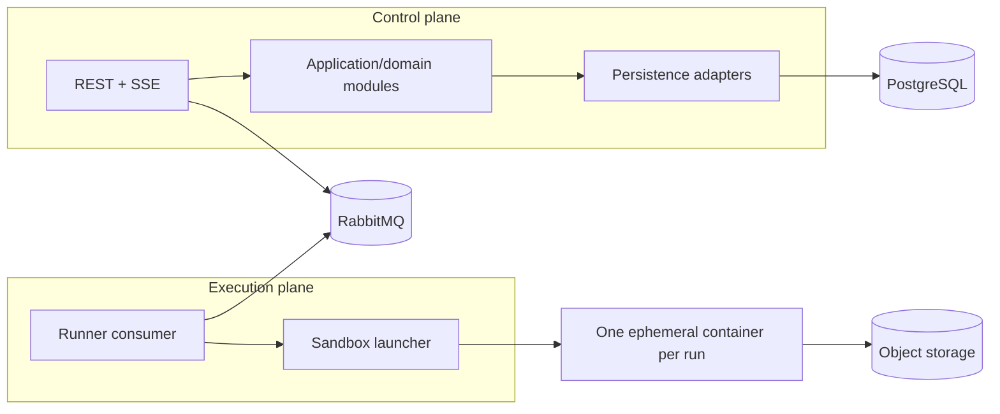

# Container Architecture

**Status: PROPOSED.** The repository currently contains API, runner, and web scaffolds plus local dependency definitions. No persistence, messaging, object-storage, or execution adapter is implemented.

The proposed initial deployment is a modular Spring Boot control plane, a separately deployable runner worker, and a Next.js web application. PostgreSQL is the proposed authoritative metadata/result store. RabbitMQ is a deferred messaging candidate. MinIO is a local S3-compatible dependency candidate.

A modular monolith is proposed to avoid premature service boundaries. Kubernetes is not an MVP dependency. The container launcher and control/execution contracts require separate architecture and security approval before implementation.
