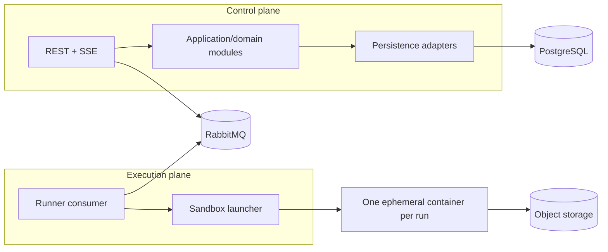

# Container Architecture

The initial deployment is a modular Spring Boot control plane, a separately deployable runner worker, and a Next.js web application. PostgreSQL stores authoritative metadata and immutable result records. RabbitMQ transports run commands and lifecycle events. Redis is optional transient state. MinIO emulates S3 locally.

A modular monolith avoids premature service boundaries while keeping ports explicit. Kubernetes is a future launcher adapter, not an MVP dependency.
