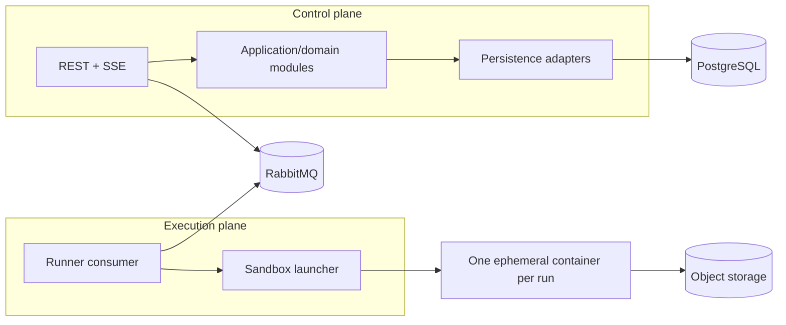

# Container Architecture

**Status: PROPOSED.** The repository contains API, runner, and web scaffolds plus local dependency definitions. PostgreSQL persistence and RabbitMQ messaging are implemented for the control plane. No object-storage adapter is implemented, and no execution adapter for user content exists. The runner does hold a container launcher, described in [ADR-022](../adr/022-hostile-execution-boundary-and-synthetic-probe.md): it runs one trusted synthetic security probe under a fixed hardened profile and is the only component with Docker daemon access.

The proposed initial deployment is a modular Spring Boot control plane, a separately deployable runner worker, and a Next.js web application. PostgreSQL is the proposed authoritative metadata/result store. RabbitMQ is a deferred messaging candidate. MinIO is a local S3-compatible dependency candidate.

A modular monolith is proposed to avoid premature service boundaries. Kubernetes is not an MVP dependency. The container launcher and control/execution contracts require separate architecture and security approval before implementation.
