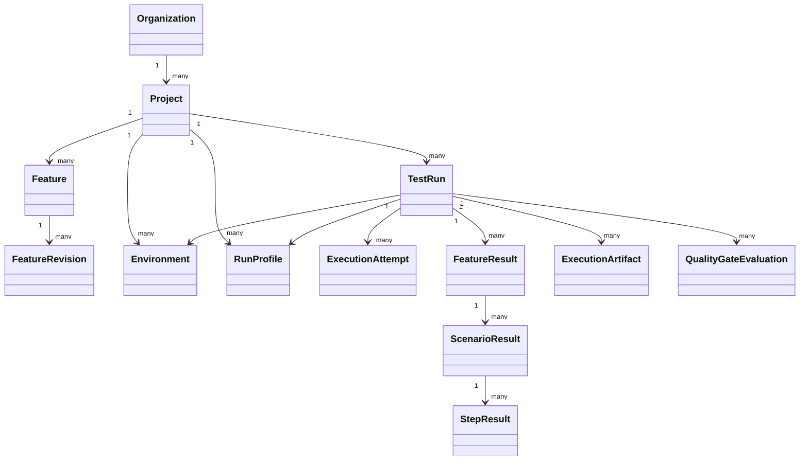

# Domain Model

**Status: PARTIALLY IMPLEMENTED.** Organization ownership anchors, Projects, Features, and immutable FeatureRevisions are implemented and persisted. Run-side types remain design only.

`Project` and the `Feature`/`FeatureRevision` lifecycle are implemented as the first control-plane capability. A Feature is the stable logical identity and owns a contiguous, insert-only revision history; its `logicalPath` does not change in this slice. See [project-feature-slice.md](project-feature-slice.md).

`TestRun` and every execution-side relationship remain proposed. A future run snapshots selected revisions, resolved non-secret configuration, profile/environment identity, engine and policy versions. `ExecutionAttempt` is distinct from test-level scenario retries. Lifecycle, cancellation, test outcome, infrastructure outcome, and quality evaluation are orthogonal as specified in [run-semantics.md](run-semantics.md).
