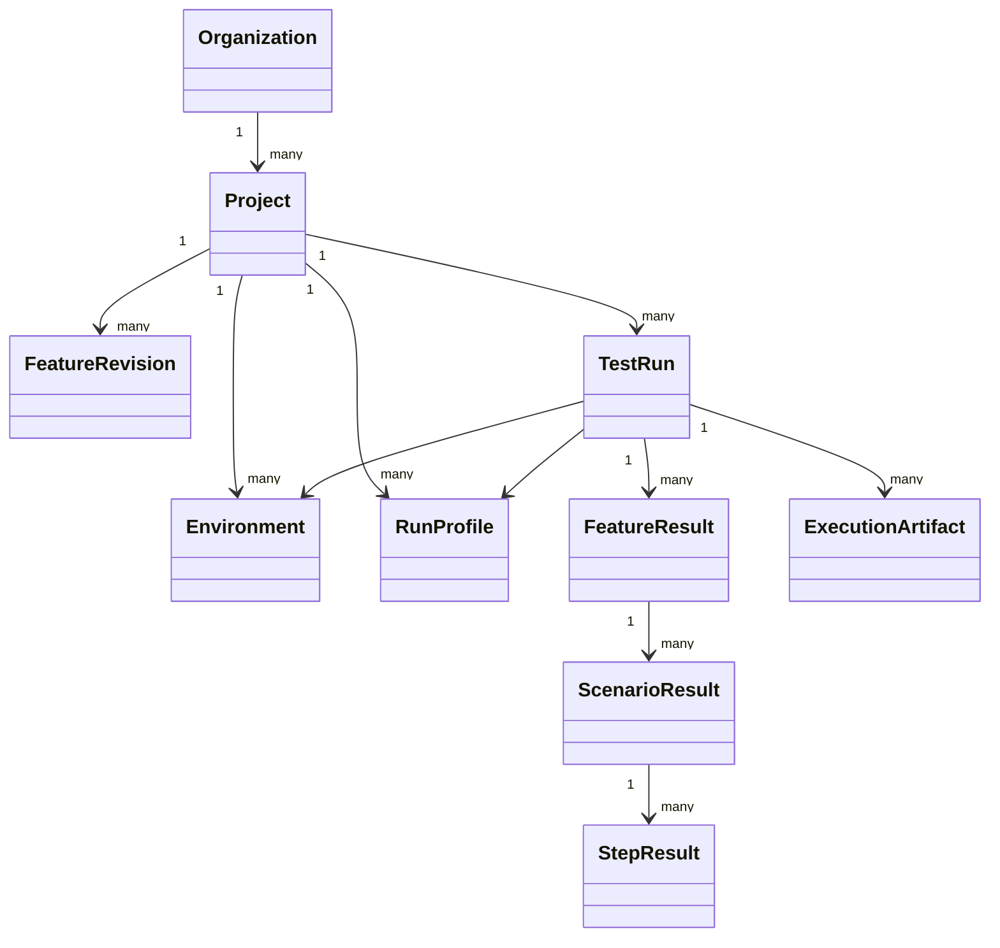

# Domain Model

Core aggregates are `Project` and `TestRun`. A run stores snapshots of the selected revision, resolved variables (excluding secret values), profile, environment, and target. Results are append-only after completion. Artifact metadata is relational; artifact bytes live in object storage. Secret values are represented by `SecretReference` and resolved only through a provider at the execution boundary.
