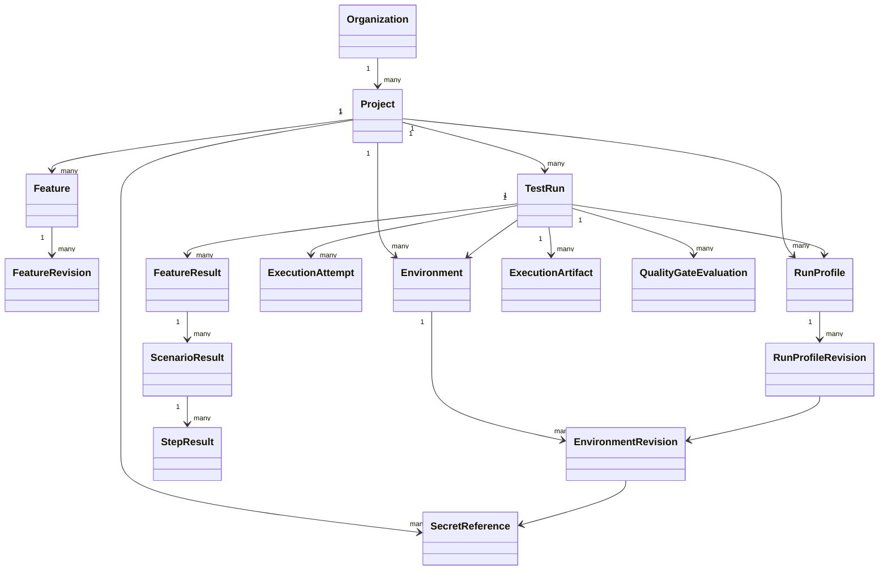

# Domain Model

**Status: PARTIALLY IMPLEMENTED.** Organization ownership anchors, Projects, Features, immutable FeatureRevisions, SecretReference metadata, Environments/EnvironmentRevisions, and RunProfiles/RunProfileRevisions are implemented and persisted. TestRun and execution-side types remain design only.

`Project` and the `Feature`/`FeatureRevision` lifecycle are implemented as the first control-plane capability. A Feature is the stable logical identity and owns a contiguous, insert-only revision history; its `logicalPath` does not change in this slice. See [project-feature-slice.md](project-feature-slice.md).

`SecretReference` is project-scoped metadata only and grants no access by possession. Environment and RunProfile are stable identities with contiguous, insert-only revisions; each RunProfileRevision pins one exact EnvironmentRevision. Normalized aggregate rows are sealed transactionally and database triggers reject all later mutation. See [environment-run-profile-slice.md](environment-run-profile-slice.md).

`TestRun` and every execution-side relationship remain proposed. A future run must select a RunProfileRevision, not a mutable RunProfile identity, and snapshot the exact EnvironmentRevision, selected FeatureRevisions, resolved non-secret configuration, and engine/policy versions. `ExecutionAttempt` is distinct from test-level scenario retries. Lifecycle, cancellation, test outcome, infrastructure outcome, and quality evaluation are orthogonal as specified in [run-semantics.md](run-semantics.md).
