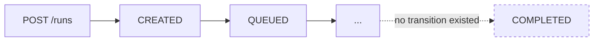
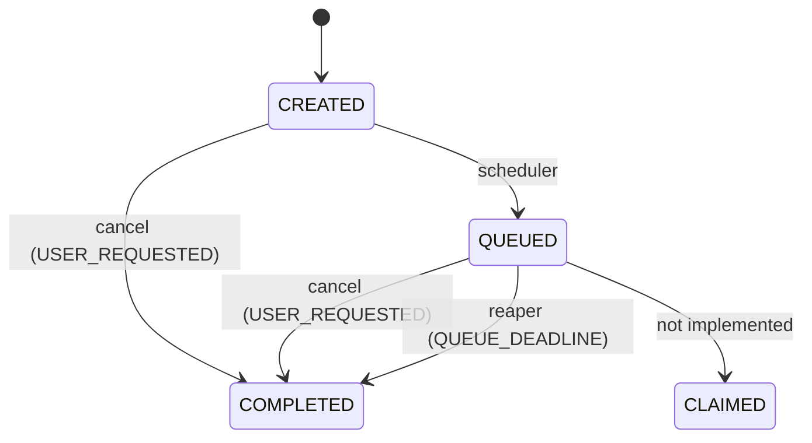

# Implemented early terminal lifecycle

**Status: IMPLEMENTED CONTROL-PLANE SLICE.** Gives the run lifecycle its first exit: tenant cancellation of unowned work, and enforcement of the queue deadline. Adds no worker claim and no execution.

## Why this exists

The admission ceiling counted every run that was not `COMPLETED`, and nothing could ever become `COMPLETED`.



So the ceiling was an availability ceiling. An organization that legitimately filled its quota was finished — permanently, with no self-service recovery. The queue deadline had the same shape: written by the scheduler since the first slice, read by nothing, so an unclaimed run held a queued slot and an active slot forever.

## What is implemented



Four transitions, and the database rejects every other shape.

| Reason | Phase | Infrastructure outcome | Cancellation status | Who acts |
|---|---|---|---|---|
| `USER_REQUESTED` | `CANCELLATION` | `CANCELLED` | `ACKNOWLEDGED` | the tenant |
| `QUEUE_DEADLINE` | `QUEUE` | `TIMED_OUT` | `NOT_REQUESTED` | `kaas.queue-reaper` |

In both cases `testOutcome` is `NOT_AVAILABLE` and `qualityGateStatus` stays `NOT_EVALUATED`. Nothing ran, so there is nothing to report and nothing to judge.

`terminationPhase` reuses the runner result contract's structured-error phase vocabulary rather than inventing a second private enum that would need reconciling the first time both appeared in one view.

## Cancelling unowned work needs nobody's cooperation

```
POST /api/v1/runs/{runId}/cancellations   {"reason":"USER_REQUESTED"}

BEGIN
  SELECT ... WHERE organization_id = ? AND run_id = ?
             AND lifecycle_state IN ('CREATED','QUEUED')
             AND cancellation_status = 'NOT_REQUESTED'   FOR UPDATE
  no row?  -> re-read, decide: already cancelled (200) / already terminal (409) / not cancellable (409) / 404
  row?     -> compare-and-set to COMPLETED, append lifecycle event,
              suppress any unclaimed pending dispatch, delete scheduling control state
COMMIT   -> 200 with the terminal run
```

There is no `STOPPING` phase and no persisted `REQUESTED` status, because there is no wait. By the time the caller is told anything, the run is over. `REQUESTED` remains in the schema for the phases a worker owns, where a request genuinely has to be honoured by somebody.

**Idempotency is by state.** The run is the scope — there is one run to cancel, so repeating the request returns the same terminal run and writes nothing. No `Idempotency-Key` is required, because a key scoped to this run's own path could not catch a mistake the run's state does not.

**A queue timeout is never reported as a cancellation.** Cancelling a run that already timed out is a `409`, not a courteous `200`: reporting it as cancelled would write a cause nobody caused into an audited record. The database enforces the same separation from below — a `TIMED_OUT` run may not carry a cancellation status, and each reason pins exactly one infrastructure outcome.

## Withdrawing a dispatch that was never sent

A cancelled run whose dispatch still publishes would send a worker to execute a run that is already over. The transaction that ends the run therefore marks its pending outbox row:

| Row state when the run ends | What happens | Why |
|---|---|---|
| unpublished, no relay holding it | `SUPPRESSED_CANCELLED` / `SUPPRESSED_QUEUE_TIMEOUT` | nothing was sent, so nothing needs recalling |
| unpublished, in retry backoff | withdrawn, keeping its attempt history | withdrawn is not the same claim as never attempted |
| unpublished, claim lease expired | withdrawn, and the dead lease cleared | the relay reclaims exactly these, so leaving it would mean a later first delivery for a finished run |
| held under a live relay lease | left alone; publishes and goes stale | it may already be at the broker, and no claim to the contrary is honest |
| already published | left alone | at-least-once delivery has always meant a consumer must reject stale work |

**Suppression is not a delivery failure.** It spends no attempt, invents no failure code, and is excluded from the relay's dead-letter count. Counting it would make every cancellation look like a broker fault and pull relay health down with it. The `TerminalDisposition` enum carries the distinction: two dispositions are written by the relay when delivery fails, two by a terminal lifecycle transition when the message is no longer wanted, and only the first pair are dead letters.

A suppressed message is also deliberately not requeueable. Replaying it would dispatch work nobody is waiting for.

## The queue-deadline reaper

```
                     ┌──────────► terminated: COMPLETED / TIMED_OUT, control row deleted
                     │
QUEUED past deadline ┼──► lost the race (cancelled, or another replica) ──► control row cleared
                     │
                     ├──► transient failure ──► durable delay, bounded ──┐
                     │                                                    │
                     └──◄ next_attempt_at elapses              quarantined (operator clears)
```

It adds no lifecycle semantics of its own: it selects and calls the same use case a tenant's cancellation calls, so the same compare-and-set, the same guards, and the same suppression apply.

Retry state is **shared with the scheduler's `run_scheduling_control`**, not duplicated. It is the same failure shape — a bounded technical retry that must survive a restart and be shared across replicas — and the two uses cannot describe the same run at the same time, because scheduling deletes the control row inside the transaction that moves the run out of `CREATED`. The guard on that table widened from `CREATED` to `CREATED` or `QUEUED` for exactly this.

The **budgets** are separate, though. A quarantined `CREATED` run is one cheap row waiting for an operator; a quarantined `QUEUED` run is still holding an active and a queued admission slot, which is the condition reaping exists to clear. Reaping therefore gets its own `kaas.reaping.backoff.*` with a far longer rope, and its own `kaas.queue-reaper.quarantined` gauge — a shared gauge would attribute a parked slot to the scheduler, and the scheduler's pass never runs for a `QUEUED` run, so it would never refresh for the runs that matter most.

Selection compares the deadline against the **database** clock, which is the authority that stamped it, and the terminal instant is clamped to be at or after the deadline. An application-side comparison would let host drift reap a run early — and the database's own guard would then reject the write, turning a clock skew into a stuck run.

Selection also takes a bounded candidate window before round-robining across organizations. Without it the planner does not use `ix_test_runs_queue_deadline`: that column's statistics are computed over the whole table, where accumulating terminal runs all have deadlines in the past, so `queue_deadline_at <= now()` is estimated at most of the queue and a bitmap scan of every `QUEUED` row wins on cost. That estimate degrades as terminal runs accumulate, which is the opposite of what a partial index on the live queue is supposed to give.

Reaping is slower than scheduling on purpose (10s against 2s). A deadline that has already passed is not more urgent for having passed a second ago, and this pass writes terminal state.

## The scheduling-only guards, rewritten as a set

Each of these was written when `CREATED → QUEUED` was the only mutation that could exist, and each encoded that differently. Patching them one at a time would have left the combined invariant inconsistent, which is why the previous two slices recorded them as a unit.

| Guard | Was | Now |
|---|---|---|
| `guard_supported_test_run_update` | one exact schedule shape | schedule, plus two terminal shapes; everything else still fails closed |
| `require_complete_scheduling_bundle` | any transition out of `QUEUED` rejected, because the attempt row exists | `QUEUED` still needs exactly one complete bundle; `COMPLETED` keeps the children it earned and may gain none |
| `guard_run_lifecycle_event` | matched only the `QUEUED` transition | matches the terminal transition too, and now also checks the actor |
| `ck_run_lifecycle_events_schedule` | `sequence = 1`, `CREATED → QUEUED`, actor pinned | dropped, and replaced by `ck_run_lifecycle_events_transition`: three shapes, with `run_version = sequence + 1` |
| `guard_outbox_message` | claim, release, publish, retry, terminal, requeue | plus suppression; requeue narrowed to delivery failures only |
| `guard_run_scheduling_control` | `CREATED` only | `CREATED` or `QUEUED` |

`run_lifecycle_events.attempt_id` became nullable, because a run cancelled while still `CREATED` never had an attempt. The composite foreign key is `MATCH SIMPLE`, so a null skips the *whole* constraint — the tenancy and run binding along with the attempt. For a `CREATED → COMPLETED` event that binding therefore rests on `guard_run_lifecycle_event`, which matches every event against the authoritative run row; the attempt's presence is tied to the transition shape.

A terminal run **keeps its scheduling children**. They are evidence of what really happened, stamped with the version they described, so the bundle check stops applying to them rather than demanding they match a version they predate.

**Terminalization ends a run's history; it does not rewrite it.** Queue timing, the attempt reference, the snapshot digest, and the quality gate are outside the set of columns the terminal branch may move.

## Capacity is genuinely released

```
active ceiling 4:  [run][run][run][run]  -> POST /runs = 429
cancel one:        [run][run][run][ -- ] -> POST /runs = 202
```

The active ceiling counts `lifecycle_state <> 'COMPLETED'` and the queued ceiling counts `lifecycle_state = 'QUEUED'`. A terminal run leaves both, so a run deferred at `CREATED` schedules on the next pass once a queued run is cancelled or reaped.

## Who is allowed to have acted

The subject of an authenticated token becomes `test_runs.updated_by` and `run_lifecycle_events.actor`. This slice makes some of those names load-bearing — a scheduling event is only valid when its actor is `kaas.scheduler`, a queue expiry only when it is `kaas.queue-reaper` — so the `kaas.` prefix is refused where a subject enters the system, and the terminal guard independently pins the actor from below. Either check alone leaves a hole: without the first, a client that can choose its own subject records its actions as the platform's; without the second, any code path that writes a terminal row can attribute it to anyone.

## Observability

`kaas.run.terminated` (by reason), `kaas.queue-reaper.failures` (by reason category), `kaas.queue-reaper.backoff-unrecorded` (for the case where the durable delay itself could not be written — it fails in exactly the outage that produces it, and a silent miss would mean a retry on every tick), and the `kaas.queue-reaper.quarantined` gauge. Counted **after commit**, so a rolled-back transaction never reports capacity that was not released. Never dimensioned by organization, project, run, or principal. Logs carry trusted resource identifiers and bounded reason codes.

## Migration-upgrade testing, extended

V7 transforms no rows, but it adds ten validated CHECK constraints — six on `test_runs`, three replacing the outbox accounting rules, and one on `run_lifecycle_events` — drops a NOT NULL, and replaces five guard functions. Every one of those is checked against every row already in the table. Over an empty table that proves nothing, and would pass while shipping a constraint production data violates.

So the populated-upgrade test now asserts, **before** the upgrade runs, that the fixture actually holds rows the pending migrations will act on: both lifecycle states, lifecycle events with attempts, and every outbox delivery state. It then asserts afterwards that nothing was transformed — no invented completion time, reason, or cancellation, and no delivery state reinterpreted as a suppression.

## What is deliberately still absent

- No cancellation for any phase a worker owns. That is a `409` until claiming lands and a real `STOPPING` protocol exists. *(Implemented for `CLAIMED` by the [consumer/claim/lease slice](consumer-claim-lease-slice.md); still a `409` for everything past it.)*
- No `REQUESTED` cancellation status is ever persisted, because nothing waits.
- No new execution-attempt disposition. The attempt keeps `WAITING_FOR_CLAIM`; the run's terminal state already says what happened, and inventing an attempt outcome would describe an execution that never started.
- No expiry of `CREATED` runs. They are cheap and nothing has established what a fair intent lifetime is.

## Constraints the worker-claim slice must still rewrite

Unchanged and deliberately not weakened *in this slice*: `guard_initial_execution_attempt` (still requires `queued_at = created_at`, impossible for attempt #2), the single-attempt uniqueness and check constraints, and the `QUEUED` branch of `require_complete_scheduling_bundle`. They must be rewritten together.

**Since superseded in part.** The [consumer/claim/lease slice](consumer-claim-lease-slice.md) replaced `guard_initial_execution_attempt` with `guard_execution_attempt`, which permits claim, heartbeat, and fence, and added `CLAIMED` and `STOPPING` branches to the bundle invariant. What still belongs to the worker-execution slice is the single-attempt uniqueness and check constraints, and the `QUEUED` branch — infrastructure retry is what forces those.
