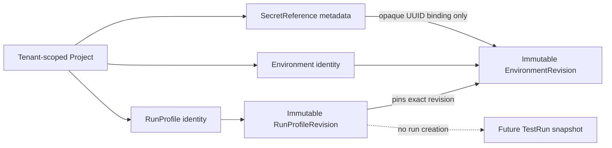

# Environment and RunProfile Slice

**Status: IMPLEMENTED AND VERIFIED.** No TestRun or execution behavior is part of this slice.



## Model and tenant boundary

Environment, RunProfile, and SecretReference belong to one trusted organization and Project. Organization identity comes only from the validated JWT principal. Every item, list, revision, and reference lookup includes organization and the complete project/parent hierarchy. Foreign and nonexistent identifiers return the same `404 NOT_FOUND` response.

Environment and RunProfile are stable identities. Each has a contiguous immutable revision history allocated from a persisted counter while its tenant-scoped identity row is locked. Atomic identity creation also creates revision 1. Responses for logical identities contain no mutable “latest revision” field, so idempotent creation replay remains the original representation.

## Configuration and limits

EnvironmentRevision contains at most 100 plain variables and 50 secret bindings. Keys are case-sensitive and match `^[A-Za-z_][A-Za-z0-9_.-]{0,127}$`. A key is unique across both collections. `FOO` and `foo` are distinct.

Plain values are only:

- `STRING`: exact, control-free, well-formed Unicode, at most 4096 UTF-8 bytes;
- `INTEGER`: an exact integer in the JavaScript-safe range `-9007199254740991..9007199254740991`;
- `BOOLEAN`: JSON `true` or `false`.

Decimal and null values, nested JSON, arrays, and implicit string conversion are rejected.

SecretBinding contains only a configuration key and a project-scoped SecretReference UUID. SecretReference contains a UUID, project ID, portable name, and creation audit. There is no field or endpoint for a value, ciphertext, provider, provider path, URI, credential, token, retrieval, redemption, or reveal operation.

RunProfileRevision contains one immutable EnvironmentRevision UUID, up to 100 unique tags, parallelism `1..32`, scenario attempts `1..5`, retry delay `0..30000` milliseconds, timeout `1..3600` seconds, the existing bounded artifact policy, and up to 100 plain typed overrides. Network policy and quality-gate references are absent rather than simulated.

## Precedence

Future snapshot assembly will apply:

```text
EnvironmentRevision plain values and secret bindings
        ↓
RunProfileRevision plain overrides
        ↓
Future explicit TestRun overrides (not implemented)
```

A profile override with the same key replaces an environment plain value only when its explicit type matches the environment value. A new key is added. Type changes and plain overrides that collide with an environment secret-binding key are rejected as `VALIDATION_FAILED` with a safe field-independent message. Secret bindings cannot be overridden in this slice.

## Canonical digests

Digests are lowercase `sha256:` values over a domain-separated version marker followed by fixed-order fields encoded as four-byte big-endian UTF-8 byte length plus bytes.

Environment canonicalization uses `kaas.environment-revision-content.v1` and entries sorted by key. Each entry contributes its kind, key, explicit type, and exact typed value. Secret bindings contribute only the secret-reference UUID. Revision/resource IDs, names, revision number, and audit fields are excluded.

RunProfile canonicalization uses `kaas.run-profile-revision-content.v1`, the pinned Environment UUID, EnvironmentRevision UUID and content digest, sorted tags, fixed-order numeric settings, sorted artifact types and bounds, and overrides sorted by key with explicit type/value. Including the environment content digest makes the transitive immutable input explicit. JSON property order, whitespace, list order for semantic sets, and map iteration order do not affect either digest.

## Persistence and immutability

Flyway owns the schema and Hibernate remains `ddl-auto=validate`. Normalized child tables enforce key/type/reference constraints. Composite foreign keys prevent cross-organization and cross-project attachment, including RunProfileRevision to EnvironmentRevision and SecretBinding to SecretReference.

Revision creation uses a transactional seal:

1. lock the logical identity and allocate the next number;
2. insert an unsealed revision header;
3. insert its normalized children;
4. perform the only permitted header update, `sealed=false` to `sealed=true`;
5. commit only if a deferred trigger observes the sealed state.

Sealed header update/delete and every later child insert/update/delete are rejected by PostgreSQL. No application update/delete use case or HTTP route exists.

## Explicitly absent

TestRun persistence, snapshot assembly, RabbitMQ, outbox/inbox, SSE, Karate, runner activation, container launching, object storage, provider SDKs, secret values/redemption, network enforcement, and quality-gate execution remain absent. See [ADR-015](../adr/015-versioned-execution-configuration.md).
