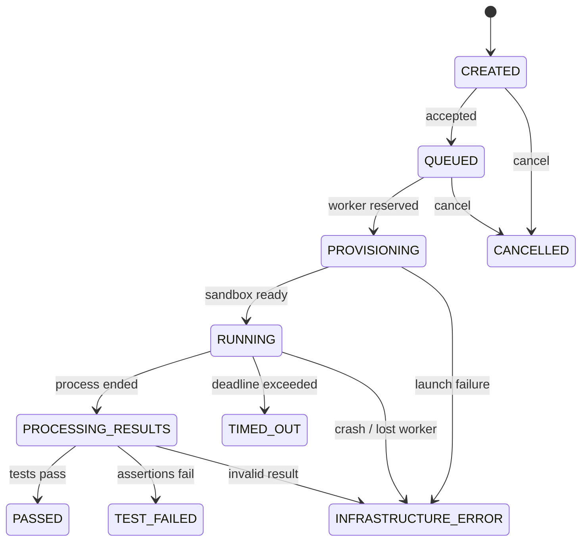

# Execution Lifecycle

`TEST_FAILED` means the runner completed and a test assertion failed. `INFRASTRUCTURE_ERROR` means KaaS cannot trust the test outcome. `TIMED_OUT` is an execution outcome with explicit deadline evidence. State transitions are monotonic, persisted, audited, and emitted as ordered events.
