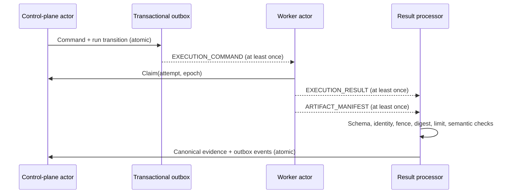

# Execution Protocol

**Status: PROPOSED CONTRACT ARCHITECTURE.** The schemas are machine-validated design artifacts; no publisher, consumer, secret provider, storage adapter, launcher, or test engine exists.

## Protocol boundaries

The control plane creates an immutable execution command for one attempt. A future worker may claim it, obtain separately authorized capabilities, execute through an approved launcher, and return a structured result plus artifact manifest. The control plane validates and canonicalizes evidence. The API never executes test content.

## Contract classes

| Contract | Authority and purpose | Primary identity |
|---|---|---|
| `EXECUTION_COMMAND` | Control-plane instruction for exactly one logical attempt; immutable snapshot | `commandId`, `messageId`, run/attempt/epoch |
| Lifecycle event | Durable fact emitted after a committed run transition | event ID, run/version |
| `EXECUTION_RESULT` | Runner evidence for one command/attempt; never includes quality evaluation | `resultId`, `messageId`, command/run/attempt/epoch |
| `ARTIFACT_MANIFEST` | Metadata describing externally stored bytes | `manifestId`, artifact IDs, command/run/attempt/epoch |
| `RunLiveEvent` | Low-volume public projection of committed durable facts | `eventId`, per-run `sequence` |

These are separate closed contracts, not an arbitrary generic payload. RabbitMQ exchange names, routing keys, delivery tags, Docker settings, filesystem paths, and bucket credentials are absent from business contracts.

## Field placement

| Location | Fields | Reason |
|---|---|---|
| Durable contract body | exact schema version/type, message/business IDs, occurred time, descriptive producer, organization/project/run/version, attempt/epoch, correlation/causation IDs, absolute command deadline, immutable typed payload | Required for audit, replay, idempotency, stale detection, tenant binding, and reproducibility independent of a broker |
| Transport headers | `traceparent`, optional `tracestate`, content type/encoding, authenticated producer context, broker delivery/redelivery metadata | Technical context can change across hops and is not domain state. W3C context may be copied into outbox technical metadata only to continue a trace. |
| Persistent business data | run snapshot, accepted command/result/manifest IDs and digests, lifecycle/outcomes, attempt/epoch, deadlines, artifact ownership/integrity, idempotency fingerprints | Needed to make future messages and API reads correct |
| Not permitted | raw secret values, provider paths/tokens, host paths, presigned URLs, stack traces, credentials, arbitrary runtime JSON, Docker/daemon configuration | Prevents durable leakage and infrastructure coupling |

`producer` is descriptive provenance, not authentication. Future transport must authenticate service identity; self-declared IDs or hashes do not prove origin. Detached signing may be evaluated if the execution boundary cannot rely on authenticated transport, but is not selected here.

## Immutable execution command

The command schema snapshots:

- engine type and exact version;
- immutable source-bundle reference and SHA-256, with feature/revision IDs, normalized logical paths, and per-feature digests;
- resolved allowlisted non-secret scalar configuration;
- environment identity, version, and digest;
- opaque secret capability references that reveal no provider path and grant nothing by possession;
- selection, parallelism, test-level retry, execution timeout, artifact bounds, and immutable network-policy identity/version/digest;
- organization/project/run/version, attempt, assignment epoch, creation time, and absolute deadline.

The server computes the normalized request fingerprint and all trusted snapshot digests. A command retry republishes identical bytes/identity. The same command ID with a different digest is tampering, not an update.

The command contains an opaque `source-bundle:` reference, not a mutable feature URL. A future worker must redeem source/secret capabilities only as an authenticated active assignment and verify downloaded bytes against the trusted digest. Possessing a reference is never authorization.

Logical paths are normalized relative POSIX workspace paths. Schema rejects URI schemes, absolute paths, dot/traversal segments, repeated separators, backslashes, and control characters; runtime must canonicalize and recheck archive entries and symlinks.

## Claim, lease, and fencing

**IMPLEMENTED through claim.** Claim is a control-plane compare-and-set, not broker acknowledgment alone. A successful claim binds one worker audit identity to `attemptId` and `assignmentEpoch` until a server-controlled lease expiry. Heartbeats carry the same attempt/epoch, renew only that lease, and produce no public event.

Reassignment must always use a higher epoch; an infrastructure retry also uses a new attempt ID and command. Only the first assignment is implemented today, so epoch 2 is permitted by the schema and produced by nothing. Result and manifest acceptance require exact active epoch. This makes a partitioned old worker unable to commit evidence after fencing.

## Result and artifact exchange

`EXECUTION_RESULT` carries structured evidence and the same trusted identity/fence tuple. Receivers apply limits before parsing, validate the allowlisted local schema, then check chronology, uniqueness, summary recomputation, outcome/error compatibility, command identity/digest, active state, deadline, and epoch. `retryable` in an error is advisory; retry policy belongs to the control plane.

`ARTIFACT_MANIFEST` contains only metadata and opaque `object-ref:` identities. It never contains bytes or URLs. Artifact availability requires a preauthorized reservation, immutable object creation, storage-observed size/digest verification, aggregate policy checks, and scan/quarantine policy. The manifest itself is bound to command, run, attempt, and epoch.

## Size and amplification policy

Schema cardinality limits are necessary but not sufficient. A future adapter must reject encoded and decoded size, depth, decompression-ratio, and node-count limits before allocating a full object graph. Initial upper bounds are:

| Contract | Decoded JSON limit |
|---|---:|
| Execution command | 4 MiB |
| Execution result | 16 MiB |
| Artifact manifest | 1 MiB |
| One live event | 64 KiB |

The command further caps 1,000 features, 32-way parallelism, 100 secret capabilities, 100 artifacts, 100 MiB per artifact, and 500 MiB total artifacts. Product admission limits may be lower. Nested schema maxima are defense-in-depth; the aggregate byte/node limit is authoritative.

## Acceptance and stale behavior

An exact duplicate with the same business ID and trusted digest is acknowledged with no repeated effect. Identity match with different bytes/digest, cross-tenant substitution, an impossible epoch, or forged artifact metadata is quarantined and audited as an integrity/security conflict. Unsupported versions and permanent schema failures are rejected to the DLQ path without repeated execution. Old run versions, old attempts, expired deadlines, and fenced epochs are stale no-ops after audit.

The contracts reduce ambiguity but do not provide sandbox, egress, resource, secret-redaction, tenant-storage, malware, or container isolation. Execution stays disabled until those controls have executable evidence.
