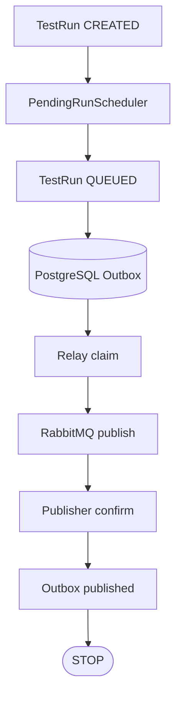
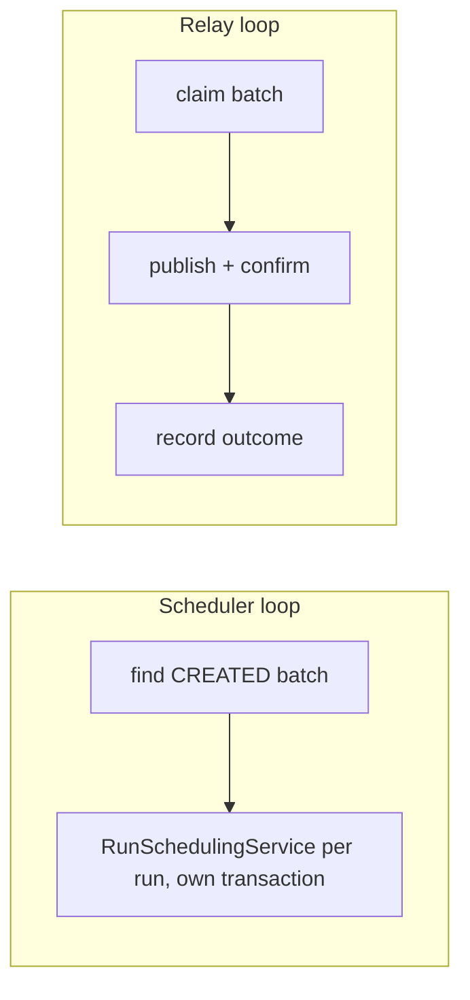

# Implemented outbox relay and RabbitMQ publication

**Status: IMPLEMENTED CONTROL-PLANE SLICE.** This document describes durable publication of already-durable messages. It does not claim consumption, worker claim, or execution.

## Boundary



Everything past the queue is deliberately absent:

- **NO production consumer** — the queue accumulates published messages that nothing reads
- **NO worker claim** — `ExecutionAttempt` stays `WAITING_FOR_CLAIM` forever
- **NO assignmentEpoch, NO lease, NO capability of any kind**
- **NO ExecutionCommand** — never produced, never published
- **NO runner, NO Karate, NO container execution, NO result processing, NO SSE**

The API runtime dependency graph now contains a RabbitMQ client, and still contains no Karate, no object-store client, no container launcher, and no secret-provider SDK.

## Two loops, two failure domains



Scanning for runs and talking to a broker are separate concerns with separate failure modes. Combining them would put broker latency inside a database transaction. The scheduler adds no semantics of its own: it invokes the established use case, so every compare-and-set and database guard from ADR-017 still applies, and multiple API replicas remain safe because the compare-and-set already resolves the race.

Timers live in `com.kaas.api.scheduling`, outside `..controlplane..`, so the architecture rule forbidding schedulers in the control plane keeps its meaning.

## Delivery state machine

```
                    ┌──────────────► published        (end state)
                    │
INSERT ──► pending ─┼──► claimed ──┬──► pending@available_at   (transient failure, attempts+1)
                    │              │
                    │              └──► terminal              (end state: RETRIES_EXHAUSTED
                    │                                          or PERMANENT_FAILURE)
                    └──◄ claim expiry (crashed relay)
```

`published_at` and `terminal_disposition` are mutually exclusive. Publication is final; a terminal disposition can be reversed only by an explicit requeue that resets the attempt budget, which exists so that a broker outage is recoverable rather than permanent. The database guard permits exactly seven transitions — claim, release, success, retry, terminal, requeue, and (since the [early terminal lifecycle slice](early-terminal-lifecycle-slice.md)) suppression — and every one of them must leave the message's identity, payload, digest, tenancy, type, version, and `occurred_at` byte-identical. Suppression is the only one not written by the relay: it withdraws an unclaimed message whose run ended, spends no attempt, records no failure, and is not a dead letter. Requeue is correspondingly narrowed to delivery failures, because replaying a suppressed message would dispatch work nobody is waiting for. The claim rules live in the guard too: a live lease cannot be stolen, a backed-off row cannot be claimed early, and an outcome cannot be recorded against an unclaimed row.

A message that fails and later succeeds clears its failure code on publication; the attempt count preserves the history.

## Relay claim protocol

| Step | Transaction | What it does |
|---|---|---|
| 1 | short | `UPDATE … WHERE outbox_id IN (SELECT … FOR UPDATE SKIP LOCKED LIMIT n)` takes a bounded batch and stamps a claim with an expiry |
| 2 | **none** | publish and wait for the broker confirmation |
| 3 | short | record success, retry, or terminal — `AND relay_claim_id = ?` |

No transaction is held across broker I/O. `SKIP LOCKED` gives concurrent relays disjoint work rather than a queue. Expired claims are reclaimable, so a crashed relay strands nothing; and because step 3 is conditional on still owning the claim, a revived relay's late write is a no-op rather than a regression.

A batch never outlives its lease: `claim-ttl` is cross-validated at startup against `batch-size × confirm-timeout`, and the relay stops early and releases untouched rows when the remaining lease no longer covers another publish. An interrupt does the same, so a shutdown cannot burn an attempt on every remaining message.

Relay claim has nothing to do with `ExecutionAttempt` worker claim.

## RabbitMQ topology

| Property | Value |
|---|---|
| Exchange | `kaas.dispatch`, direct, durable |
| Queue | `kaas.execution-dispatch`, durable |
| Routing key | `execution-dispatch` |
| Message persistence | persistent (delivery mode 2) |
| Confirms | correlated publisher confirms, per message, with timeout |
| Unroutable | mandatory flag; returns detected and retried |

Deliberately absent: per-tenant or per-project queues, dynamic queue creation, topic taxonomies, priority queues, the delayed-message plugin, and quorum or stream queues. Retry timing lives in PostgreSQL, so no optional broker plugin is required.

Topology is declared when a connection is first established, not at application startup, so a broker outage does not block the API from starting or serving reads.

## At-least-once, and the crash window

| Crash point | Outcome |
|---|---|
| after claim, before publish | claim expires; another relay reclaims and publishes |
| after publish, before confirm | treated as a confirm timeout; retried; may duplicate |
| **after confirm, before recording success** | **message is republished on the next pass — a genuine duplicate** |
| during the outcome write | statement is atomic; either it applied or the claim is still held and expires |

The third row is inherent to at-least-once and is deliberately not engineered away. Stable `messageId` plus the semantic payload digest are what make a duplicate safe for the future consumer, which must deduplicate on identity and treat the same identity with a different digest as an integrity conflict rather than a redelivery.

Nothing in this design assumes exactly-once publication, delivery, or consumption.

## Failure classification

| Failure | Class | Behaviour |
|---|---|---|
| broker unreachable, channel failure, publisher exception | transient | retry with backoff, bounded |
| publisher NACK | transient | retry with backoff, bounded |
| confirm timeout | transient | retry; the broker may still have accepted it, which is safe |
| unroutable (mandatory return) | transient | retried but counted, so a declaration race cannot strand a run; exhausts to terminal |
| digest/integrity mismatch | **permanent** | terminal on the first attempt, never retried |
| unsupported schema version or message type, malformed payload | **permanent** | terminal on the first attempt |

Backoff doubles from a base to a cap and carries bounded jitter, so an outage-induced backlog does not re-converge on one instant. Terminal messages are retained as evidence, never deleted. This relay-side disposition is authoritative for publication failure; a future consumer dead-letter queue is a separate concept.

## Generalized outbox

The outbox owns its own immutable payload, so the relay reads one table and never joins per message type. `dispatch_id` is an optional domain reference: an `EXECUTION_DISPATCH` must carry one, another fact need not. `message_type` is a controlled enum, not free-form input — `RUN_STATE_CHANGED` is declared so the generalization is demonstrable, has no producer or publisher, and is refused by the relay rather than guessed at. An undeclared type cannot be stored at all.

## Health and observability

Readiness is database-only, and the broker health indicator is excluded from the aggregate status, so a RabbitMQ outage cannot cause an orchestrator to remove a healthy control plane from service. The `outboxRelay` indicator reports pending count, terminal count, and oldest-pending age — counts only, never broker host, virtual host, credentials, topology names, or any tenant identity.

Metrics are low cardinality, dimensioned by message type and result category only, never by run, project, organization, message, or dispatch identity: `kaas.outbox.pending`, `kaas.outbox.terminal`, `kaas.outbox.published`, `kaas.outbox.publish.failed`, `kaas.outbox.retry`, `kaas.outbox.publish.duration`.

Logs carry safe identifiers and bounded failure codes. The payload is never logged.

## Local development

Compose already provides the broker, bound to loopback only, with a `rabbitmq-diagnostics ping` health check. The
checked-in credentials (`kaas` / `kaas-local-only`) are local defaults that match the application's own defaults;
production credentials come from the environment and are never committed.

The management UI is exposed on `127.0.0.1:15672` for local inspection of the exchange, queue, and message
contents. Nothing in the application depends on it: the relay uses only the AMQP port, and topology is declared by
the application itself rather than by anything clicked in the UI.

TLS is configuration-only for now (`spring.rabbitmq.ssl.*`), disabled locally and ready to be pointed at a trust
store in a deployment.

## Constraints the worker-claim slice must rewrite

Intact and deliberately not weakened here: `require_complete_scheduling_bundle` (its `ELSIF` rejects any transition out of `QUEUED`), `guard_initial_execution_attempt` (requires `queued_at = created_at`, impossible for attempt #2), `ck_run_lifecycle_events_schedule` (pins `sequence = 1`), and the single-attempt uniqueness and check constraints. They must be rewritten together.

**Since superseded in part.** The [early terminal lifecycle slice](early-terminal-lifecycle-slice.md) rewrote that set as a unit, and added a suppression transition to `guard_outbox_message` so a dispatch for a run that ended before publication is withdrawn rather than sent. What still belongs to the worker-claim slice is `guard_initial_execution_attempt`, the single-attempt constraints, and the `QUEUED` branch of `require_complete_scheduling_bundle`.
