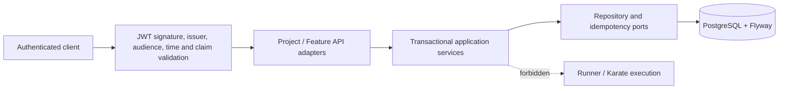

# Project and FeatureRevision Slice

**Status: IMPLEMENTED.** Runtime PostgreSQL verification requires an available Docker daemon.

The API is an OAuth 2.0 JWT resource server. Product requests require a trusted RS256 token whose issuer and audience match deployment configuration and whose `sub` and single `org_id` claims are valid. The API converts those claims into an immutable tenant principal. Request bodies and query parameters cannot choose an organization.

## Domain and ownership

- `Organization` is a minimal internal ownership anchor materialized from a trusted identity assertion on first mutation. The external identity system owns organization lifecycle; there is no organization management endpoint.
- `Project` belongs to exactly one organization. Names are trimmed, control-free, exact, case-sensitive, and unique within the organization.
- `Feature` is a logical identity belonging to one project and organization. Its safe relative `.feature` logical path is immutable and unique within the project.
- `FeatureRevision` belongs to the full organization/project/feature hierarchy. Revision 1 is inserted atomically with the Feature. Later revisions receive a contiguous number from a row-locked persisted counter.

Composite foreign keys prevent a child from being attached across tenant or parent boundaries. Every item query includes trusted organization and full parent identifiers. No unscoped `findById` participates in API authorization. A foreign UUID and a nonexistent UUID produce the same safe 404.

## Source and immutability

Source is opaque content, not an instruction to the API. It is neither parsed as Karate nor passed to a shell, process, runner, broker, or container. The decoded JSON string is validated for nonempty well-formed Unicode, disallowed controls, NUL, and a 524288-byte UTF-8 limit. The exact UTF-8 bytes are SHA-256 hashed and stored without line-ending or Unicode normalization. Revision lists omit source; individual revision reads return the exact stored value.

The application exposes no update/delete persistence operation for revisions. PostgreSQL also rejects every direct UPDATE or DELETE with an immutability trigger. Foreign keys have no delete cascade.

## Idempotency and concurrency

Every creation endpoint requires a URL-safe 8–128 character `Idempotency-Key`. The database scope contains organization, principal, operation, parent path, and key. The fingerprint is constructed from typed validated fields in fixed order; source contributes its exact UTF-8 representation. A PostgreSQL transaction advisory lock serializes concurrent use of a previously unseen scope/key. Same fingerprint replays the original 201 resource and Location; another fingerprint returns 409.

Revision creation first validates and hashes source, then locks the tenant-scoped Feature row, consumes `next_revision_number`, increments it, and inserts the revision in the same transaction. Rollback restores the counter. The unique composite revision-number constraint remains defense in depth.

## Failure and observability behavior

Both MVC errors and security-filter errors use `application/problem+json` with stable `code` and server-generated `requestId`. Values, source, tokens, SQL text, constraint names, and concealed tenant identity are never copied into problem details. The correlation filter places `requestId` and a valid incoming W3C trace ID, when present, into Logstash-format structured logging context. Spring Boot Actuator supplies aggregate HTTP request count/error/latency metrics; resource IDs are not metric labels.

See [ADR-014](../adr/014-project-feature-revision-slice.md) and the [OpenAPI contract](../api/openapi-v1.yaml).
