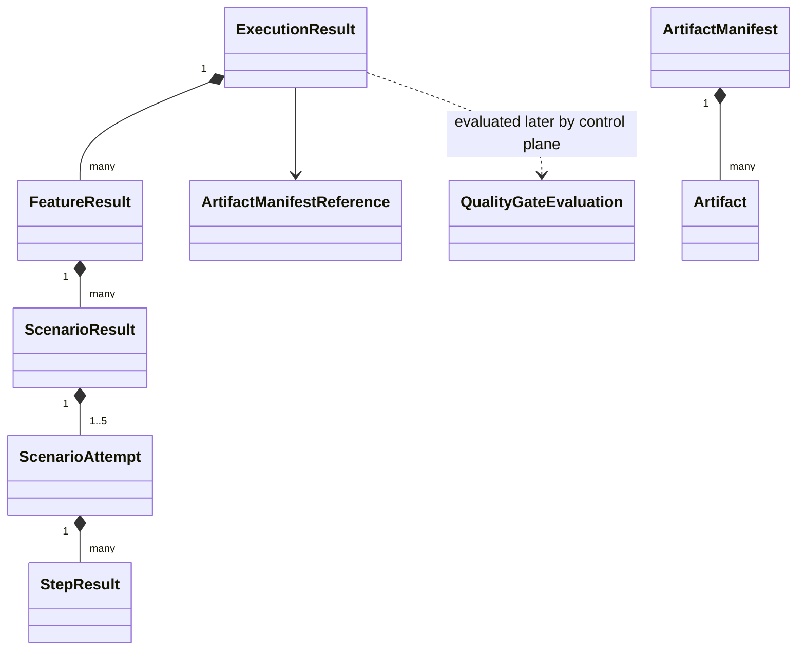

# Structured Result and Artifact Model

**Status: PROPOSED CONTRACT ARCHITECTURE.** The schemas and fixtures are executable design artifacts. No engine mapping, object storage, or quality evaluator is implemented. A result processor and result persistence now exist under [ADR-024](../adr/024-synthetic-execution-lifecycle.md), accepting one result per assignment as immutable evidence; the results they accept come from a synthetic workload rather than a test engine, and report zero tenant features.

## Model

An execution result is immutable evidence for one command, run, infrastructure attempt, and assignment epoch. It separates `testOutcome`, `infrastructureOutcome`, and `resultCompleteness`. It cannot contain quality-gate fields because `additionalProperties:false` closes every level.

When a worker cannot produce evidence (for example lease loss), the control-plane reconciler may synthesize the terminal infrastructure-failure result envelope with `NOT_AVAILABLE`, `NONE`, zero summaries, and a structured infrastructure error. It never invents feature/scenario/step evidence, and producer provenance identifies the reconciler.

## Status and aggregation

Feature, scenario, scenario-attempt, and step status is `PASSED`, `FAILED`, `SKIPPED`, or `ABORTED`.

- `FAILED` means executed test logic or a test hook produced a trustworthy failure.
- `SKIPPED` means selected evidence was intentionally not executed according to engine semantics.
- `ABORTED` means execution began or was selected but could not finish; it is not a passing result.
- A failed before/after hook makes its scenario attempt `FAILED` when the engine attributes the hook to that scenario.
- Feature status aggregates final logical scenario statuses; any failed/aborted scenario prevents feature `PASSED`.
- Execution test outcome uses final logical scenario outcomes, not every retry attempt. Any final failed/aborted logical scenario gives `FAILED`; all selected final scenarios passing gives `PASSED`.
- Parent durations are elapsed wall-clock. With parallel execution, child durations are not additive and need not equal parent duration.

The summary uses separate count sets for features, logical scenarios, and steps from the **final test-level attempt** of each logical scenario. Failed earlier retry attempts remain evidence in `scenario.attempts[]` but do not double-count the final logical outcome. The control plane recomputes all counts/statuses and rejects inconsistent evidence; JSON Schema cannot prove arithmetic consistency.

## Scenario identity and retry

`scenarioDefinitionId` is stable within an immutable feature revision. `scenarioKind` distinguishes a normal `SCENARIO` from `OUTLINE_EXAMPLE`. Outline identity includes a zero-based `index`, stable row ID that includes the Examples block identity, and SHA-256 of the canonical source row. Display names and substituted values are never identity, and example values are not copied into the result contract.

`scenario.attempts[]` records Karate/test-level retry inside one infrastructure attempt. Attempt numbers are one-based, contiguous, and bounded by the command. Each attempt preserves its ordered executable units. This is unrelated to `ExecutionResult.attemptNumber`.

## Steps, backgrounds, and hooks

A step requires `id`, `kind`, `keyword`, `text`, status, and elapsed duration.

- Background steps use `kind=BACKGROUND` and are repeated in each scenario attempt because that is how they execute.
- Scenario steps use `kind=SCENARIO`.
- Hooks use `kind=HOOK` plus a required phase (`BEFORE_FEATURE`, `AFTER_FEATURE`, `BEFORE_SCENARIO`, `AFTER_SCENARIO`). Hook phase is forbidden for other kinds.

Step text, scenario names, and feature names are tenant-sensitive test content. They may be displayed only with output encoding and must not be copied into logs, metric labels, span names, or error diagnostics.

## Errors and completeness

Test errors and infrastructure errors are different closed shapes.

- A test error has a bounded code/category/message and optional opaque diagnostic reference. Categories include assertion, script, data, hook, and internal-test failure.
- An infrastructure error adds phase and advisory `retryable`; categories include validation, provisioning, execution, timeout, resource limit, collection, artifact, and internal failure.

Messages are sanitized display summaries. Stack traces, environment dumps, commands, credentials, raw responses, host paths, and secret values are forbidden. Diagnostics are opaque references to separately authorized data.

`resultCompleteness` is `COMPLETE`, `PARTIAL`, or `NONE`. For the MVP, only `SUCCEEDED + COMPLETE` can yield `PASSED` or `FAILED`. Non-success infrastructure makes the canonical test outcome `NOT_AVAILABLE`; partial evidence may support diagnosis but never a quality gate.

## Semantic validation beyond JSON Schema

Before accepting evidence, the result processor must enforce:

- encoded/decoded byte, depth, and aggregate node limits before full parsing;
- trusted organization/project/run/command/attempt/epoch identity equality;
- current lifecycle/version/deadline and authenticated producer;
- ordered timestamps within the assigned attempt window;
- unique feature/revision, scenario, result, manifest, and artifact identities;
- contiguous scenario retry numbering and final-status agreement;
- recomputed summaries and parent outcomes;
- legal outcome/error/completeness matrix;
- normalized logical paths; and
- artifact-policy and manifest cross-binding.

The contract validator has named semantic checks for chronology, canonical summary recomputation, cross-contract identity, uniqueness, progress, and aggregate fixture limits. Runtime semantic validation remains deferred.

## Artifact manifest

The manifest is a separate `ARTIFACT_MANIFEST` contract. Every artifact includes ID, allowlisted type, claimed content type, exact stored-byte size, lowercase SHA-256, opaque control-plane-issued object reference, and creation time. The digest covers the exact stored bytes (compressed bytes if the stored object is compressed).

Object bytes never appear in a message or result. The runner supplies no URL, bucket name, credential, or unrestricted key. A future upload flow must reserve run/attempt-scoped object identities and use a short-lived narrowly scoped capability or worker-mediated upload.

Content type is a claim, not trust. The control plane verifies storage size/digest, sniffs and scans according to policy, and only then emits `ARTIFACT_AVAILABLE`. HTML and `OTHER` are attacker-controlled active content: attachment/download is the default; any rendering requires an isolated origin plus restrictive CSP/sandbox and `nosniff`. Logs render as escaped text with ANSI/control filtering.

## Quality-gate separation

`QualityGateEvaluation` is a control-plane record with independent `evaluationVersion`, status, evaluation time, policy version, and bounded checks (`name`, typed actual, operator, typed expected, status). The minimal model is intentionally not a rule engine.

The quality evaluator reads immutable canonical results, recomputes values, and appends a versioned evaluation. The runner cannot claim, influence, or serialize gate status. A policy update can produce a new evaluation without rewriting raw evidence or run outcomes.
