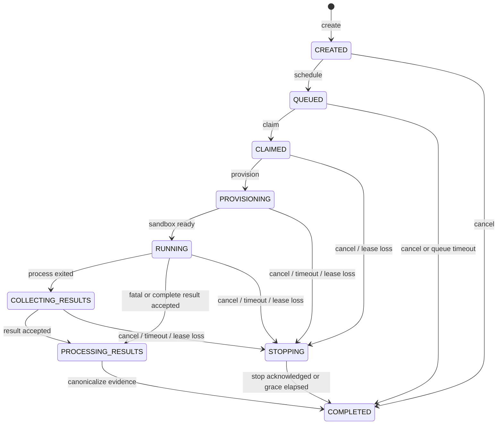

# Run State Machine

**Status: PARTIALLY IMPLEMENTED.** The pure transition oracle, exact `none → CREATED` persistence, and the atomic `CREATED → QUEUED` scheduling transition are implemented. Every transition out of QUEUED, and all claim/lease/messaging/deadline handlers, remain proposed.

## State flow

`STOPPING` carries a `stopCause`: `USER_REQUESTED`, `PROVISIONING_TIMEOUT`, `EXECUTION_TIMEOUT`, or `RESULT_COLLECTION_TIMEOUT`. Queue timeout terminalizes directly because no worker owns the attempt. Result-processing timeout terminalizes from `PROCESSING_RESULTS` as infrastructure failure after quarantining incomplete derived data; it does not need to stop a sandbox.

## Transition table

Every row assumes authenticated/authorized internal actors and schema/size validation. “Atomic effects” means the aggregate mutation, audit record, idempotency/inbox effect where applicable, and outgoing outbox record are committed together.

| Current | Event → result | Actor | Preconditions and expected version | Durable atomic effects | Emitted durable event | Retry / idempotency | Timeout / terminal | Invalid or race behavior |
|---|---|---|---|---|---|---|---|---|
| none | `CREATE_RUN` → `CREATED` | API | Authorized project; exact owned revisions; valid scoped idempotency key | TestRun + sealed snapshot + key/fingerprint/response metadata, `runVersion=1` | none in this bounded slice | Same key+fingerprint replays original; same key+different fingerprint is 409 | No queue deadline; nonterminal | Advisory transaction lock serializes concurrent same-key creation; loser reads original |
| `CREATED` | `SCHEDULE` → `QUEUED` | Scheduler (internal) | **IMPLEMENTED:** `expectedRunVersion` compare-and-set; no cancellation | Create attempt 1 awaiting claim, immutable queue-time DispatchIntent + digest, `queuedAt`, queue deadline, lifecycle event, unpublished outbox row; increment version | `RUN_STATE_CHANGED` persisted; nothing published | Repeat scheduling observes already QUEUED and writes nothing; concurrent schedulers yield one winner | Queue-wait timer starts here; nonterminal | Cancellation blocks scheduling; no production trigger invokes the scheduler yet |
| `CREATED`,`QUEUED` | `REQUEST_CANCEL` → `COMPLETED` | API | `expectedRunVersion`; not processing/terminal | Record request+ack times; `NOT_AVAILABLE/CANCELLED`; cancel idempotency response | `RUN_STATE_CHANGED`, `EXECUTION_COMPLETED` | Exact repeat returns same representation; conflicting key is 409 | Immediate terminal | Claim/schedule/result after winning cancel is stale and acknowledged without effect |
| `QUEUED` | `CLAIM` → `CLAIMED` | Worker gateway | Current attempt; queue deadline open; `expectedRunVersion`; new active epoch | Store lease owner audit, epoch, expiry, last-seen; increment version | `RUN_STATE_CHANGED` | Same attempt+epoch returns existing claim; competing claim rejected | 30s lease; nonterminal | Cancel/queue-timeout CAS first rejects claim |
| `CLAIMED` | `HEARTBEAT` → `CLAIMED` | Worker gateway | Exact attempt+epoch; lease not fenced | Update `lastHeartbeatAt` and `leaseExpiresAt` only | none | Repeated heartbeat is safe | Extends lease; nonterminal | Old epoch/deadline/terminal heartbeat is stale; no version change |
| `CLAIMED` | `PROVISIONING_STARTED` → `PROVISIONING` | Worker gateway | Exact attempt+epoch; live lease; `expectedRunVersion` | Record provisioning start/deadline; increment version | `RUN_STATE_CHANGED` | Exact duplicate at resulting state is no-op | 2m provisioning deadline; nonterminal | Cancel/lease fencing CAS first makes event stale |
| `PROVISIONING` | `SANDBOX_READY` → `RUNNING` | Worker gateway | Exact attempt+epoch; live lease; provisioning deadline open; `expectedRunVersion` | Record execution start/absolute execution deadline; increment version | `RUN_STATE_CHANGED`, `EXECUTION_STARTED` | Exact duplicate is no-op | Command timeout, default 5m/max 1h; nonterminal | Timeout/cancel CAS first fences late ready event |
| `RUNNING` | `PROCESS_EXITED` → `COLLECTING_RESULTS` | Worker gateway | Exact attempt+epoch; `expectedRunVersion`; no stop won | Record exit observation/result-collection deadline; increment version | `RUN_STATE_CHANGED`, coalesced `PROGRESS` | Duplicate is no-op | 2m collection/upload deadline; nonterminal | Accepted result may race and skip directly to processing; CAS decides |
| `RUNNING`,`COLLECTING_RESULTS` | `RESULT_ACCEPTED` → `PROCESSING_RESULTS` | Result processor | Schema+semantic limits; full trusted identity, command, epoch, digest; `expectedRunVersion`; no stop won | Inbox/result ID+digest, immutable raw evidence reference, processing deadline; increment version | `RUN_STATE_CHANGED` | Same result ID+digest no-op; conflicting digest quarantined/security audit | 2m processing deadline; cancellation now too late | Stop CAS first makes result stale; accepted-result CAS first makes cancellation 409 |
| `PROCESSING_RESULTS` | `RESULT_CANONICALIZED` → `COMPLETED` | Result processor | Accepted result; summaries recomputed; manifest verified or policy permits empty; `expectedRunVersion` | Canonical result/outcomes, artifact registrations, terminal timestamps; increment version | `RUN_STATE_CHANGED`, `ARTIFACT_AVAILABLE` as verified, `EXECUTION_COMPLETED` | Duplicate finalization reads immutable terminal record | Terminal | Different result/manifest cannot replace evidence |
| `CLAIMED`,`PROVISIONING`,`RUNNING`,`COLLECTING_RESULTS` | `REQUEST_CANCEL` → `STOPPING` | API | `expectedRunVersion`; no result accepted | Record cancellation request, stop cause, cancel command outbox; fence new work; increment version | `RUN_STATE_CHANGED` | Natural run cancellation plus scoped key; one stop command identity | 30s cancel grace; nonterminal | Result CAS first yields 409; cancel CAS first makes ordinary result stale |
| `PROVISIONING`,`RUNNING`,`COLLECTING_RESULTS` | `PHASE_DEADLINE` → `STOPPING` | Reconciler | Server clock past stored absolute deadline; `expectedRunVersion` | Record timeout cause, fence epoch, stop command outbox; increment version | `RUN_STATE_CHANGED` | Repeated reconciliation sees STOPPING/no-op | 30s stop grace; nonterminal | Late worker success cannot override timeout commit |
| `STOPPING` | `STOP_ACKNOWLEDGED` or `STOP_GRACE_EXPIRED` → `COMPLETED` | Worker gateway or reconciler | Matching stop identity; `expectedRunVersion`; or server grace elapsed | Ack cancellation if user-caused; set `NOT_AVAILABLE` and `CANCELLED` or `TIMED_OUT`; cleanup-needed audit; increment version | `RUN_STATE_CHANGED`, `EXECUTION_COMPLETED` | Duplicate stop ack is terminal no-op | Terminal | Late result/heartbeat/manifest is stale and quarantined if conflicting |
| `QUEUED` | `QUEUE_DEADLINE` → `COMPLETED` | Reconciler | Server clock past queue deadline; `expectedRunVersion`; unclaimed | Set `NOT_AVAILABLE/TIMED_OUT` with phase `QUEUE`; increment version | `RUN_STATE_CHANGED`, `EXECUTION_COMPLETED` | Repeated reconciliation is terminal no-op | Default 5m; terminal | Claim CAS first wins and queue timeout becomes stale |
| `CLAIMED`,`PROVISIONING`,`RUNNING`,`COLLECTING_RESULTS` | `LEASE_EXPIRED` → `STOPPING` | Reconciler | Expiry plus 30s recovery window; exact epoch; `expectedRunVersion` | Fence epoch; record worker-lost diagnostic; stop/cleanup intent; increment version | `RUN_STATE_CHANGED` | Reconciliation is idempotent for fenced epoch | Stop grace then `FAILED`; nonterminal now | Late heartbeat cannot renew fenced epoch; no automatic retry |
| `PROCESSING_RESULTS` | `PROCESSING_DEADLINE` → `COMPLETED` | Reconciler | Server clock past deadline; `expectedRunVersion` | Quarantine incomplete derived data; set `NOT_AVAILABLE/FAILED` with `RESULT_PROCESSING`; increment version | `RUN_STATE_CHANGED`, `EXECUTION_COMPLETED` | Repeated reconciliation is terminal no-op | Default 2m; terminal | Late processing cannot publish canonical evidence |
| `PROCESSING_RESULTS`,`COMPLETED` | `REQUEST_CANCEL` → unchanged | API | Current state read after bounded CAS retry | No lifecycle mutation; persist/replay problem response as applicable | none | Same key replays same conflict | Terminal or point-of-no-return | Returns 409 `LIFECYCLE_CONFLICT`; does not discard accepted evidence |
| any | duplicate/stale/unsupported transition → unchanged | Any | Message ID, run version, attempt, epoch, state, deadline checked | Inbox/audit/quarantine only as appropriate | none | Exact duplicate ACK; stale ACK+audit; tampering reject/quarantine | Terminal remains immutable | Never retry permanent validation/version/tampering errors |

## Cancellation race policy

Cancellation is idempotent at the API but not retroactive. The first valid compare-and-set determines the branch:

- Result accepted first: lifecycle enters `PROCESSING_RESULTS`; cancellation returns 409 and evidence completes normally.
- Cancellation committed first: lifecycle enters `STOPPING`; later ordinary success or assertion result is stale and cannot override cancellation.
- Timeout committed first: late success is stale; infrastructure outcome remains `TIMED_OUT`.
- Early cancellation before claim completes immediately and prevents a claim from satisfying its version precondition.

Control-plane commit order, not runner timestamps or broker arrival order, decides races.

## Timeout and lease profile

| Concern | MVP default | Behavior |
|---|---:|---|
| Queue wait | 5 minutes | `QUEUED → COMPLETED`, `TIMED_OUT`, phase `QUEUE` |
| Claim lease | 30 seconds | Heartbeat every 10 seconds; expiry starts a 30-second recovery window before fencing |
| Provisioning | 2 minutes | `PROVISIONING → STOPPING`, timeout cause |
| Execution | 5 minutes, request range 1 second–1 hour | Absolute command deadline; `RUNNING → STOPPING` |
| Result collection/upload | 2 minutes | `COLLECTING_RESULTS → STOPPING` |
| Result processing | 2 minutes | `PROCESSING_RESULTS → COMPLETED`, infrastructure failure |
| Stop/cancel grace | 30 seconds | Terminalize after acknowledgment or grace; external cleanup remains required |

Durations are initial contract defaults, not measured SLOs. Implementations must use server-controlled absolute deadlines and define clock-skew tolerance. A database terminal state does not prove a partitioned sandbox stopped; future launcher reconciliation must verify cleanup.

## Ordering requirement

Broker ordering is never required for correctness. The only ordered public sequence is a per-run SSE sequence allocated durably with its event. Lifecycle correctness uses current state, `runVersion`, attempt identity, and `assignmentEpoch`. Scenario steps and test retry attempts preserve their source execution order inside one immutable result document; that is evidence ordering, not broker ordering.
