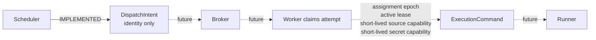
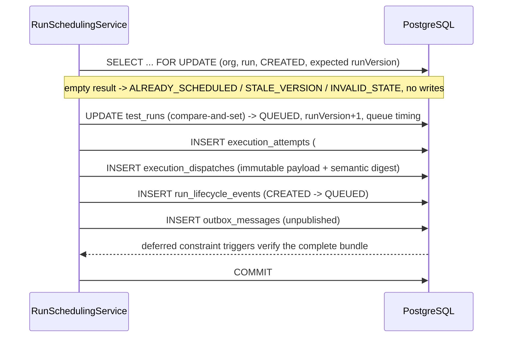

# Implemented run scheduling, execution attempt, and transactional outbox

**Status: IMPLEMENTED CONTROL-PLANE SLICE.** This document describes exactly one lifecycle transition, `CREATED → QUEUED`, and the durable records it creates. It does not claim broker publication, worker claim, or execution.

## Boundary

Scheduling is an internal application use case (`RunSchedulingService`). There is deliberately no public scheduling endpoint: the API surface still exposes only create, get, list, and snapshot. When scheduling runs, the public evidence is that `GET /api/v1/runs/{runId}` reports `QUEUED`, `runVersion` 2, server-owned queue timing, and the strong ETag `"run-2"`.

The transition is implemented but **not yet triggered in production**. Nothing calls `RunSchedulingService` outside tests — there is no timer, no relay, and no endpoint — so a deployed run stays `CREATED` at `runVersion` 1. That is deliberate for this slice: a trigger without a publisher would queue runs that nothing can ever dequeue. The trigger arrives with the outbox relay.

No code in this slice publishes to a broker, claims an attempt, mints an assignment epoch or lease, issues a secret or source capability, produces an `ExecutionCommand`, packages sources, launches a process or container, or runs Karate. The API runtime dependency graph still contains no AMQP client, no Karate, no object-store client, and no container launcher.

## The protocol distinction this slice enforces

Queue-time dispatch intent and claim-time execution command are different messages with different authority. Collapsing them would mean minting security capabilities before any bearer exists.



`DispatchIntent` states that one attempt of one run is waiting to be claimed. It carries sixteen fields and nothing else: schema/message/dispatch identity and producer, organization and project, run and semantic `runVersion`, attempt identity and number, sealed `RunSnapshot` identity and digest, `occurredAt`, the server-owned `queueDeadlineAt`, and its own `payloadDigest`.

It carries no assignment epoch, worker identity, lease, secret capability, source capability, presigned URL, object-store location, Docker configuration, host path, credential, broker routing key, or feature source. `runner-command.schema.json` is explicitly retitled as claim-time only and is not produced here.

## Transition and timing

```
before                              after
  lifecycleState = CREATED            lifecycleState = QUEUED
  runVersion     = 1                  runVersion     = 2
  queueStartedAt = null               queueStartedAt = server clock
  queueDeadlineAt= null               queueDeadlineAt= queueStartedAt + kaas.scheduling.queue-timeout
```

Queue timing begins only at `QUEUED`, preserving the correction ADR-016 made when it removed `queueDeadlineAt` from `CREATED`. Both timestamps are server owned and read from the database clock; clients cannot supply or influence them, and the timeout is configuration rather than request data.

Run creation stamps its audit fields from the application clock, so queue start is clamped never to precede the run's own last update. Without that clamp, ordinary clock drift between the API host and the database host would make the monotonicity guard reject a perfectly valid transition until wall time caught up.

## Atomic bundle

One PostgreSQL transaction performs the whole scheduling decision:



The invariant is `QUEUED ⇒ a durable attempt, dispatch, lifecycle event, and unpublished outbox message all exist`. A failure anywhere leaves the run `CREATED` with none of them. Because the service is `@Transactional` and joins the caller's transaction, a caller that rolls back undoes every write together.

## Optimistic concurrency

The transition is a conditional `UPDATE` predicated on organization, run, `lifecycle_state = 'CREATED'`, cancellation `NOT_REQUESTED`, and the expected `run_version`, preceded by `SELECT … FOR UPDATE` on the same predicate. Concurrency is resolved by PostgreSQL row locking and re-qualification only — never by `synchronized`, a JVM lock, or an application singleton, none of which survive a second control-plane instance.

Ten concurrent schedulers therefore yield exactly one `SCHEDULED` and nine `ALREADY_SCHEDULED`, with one attempt, one dispatch, one outbox row, and `runVersion` 2. Scheduling is idempotent by state and invariants rather than by a client-supplied key, which scheduling does not accept.

## Persistence invariants

Migration V4 adds `execution_attempts`, `execution_dispatches`, `run_lifecycle_events`, and `outbox_messages`, plus `test_runs.current_attempt_id`.

V3 made every `test_runs` update fail closed. V4 narrows rather than removes that guard: a trigger permits exactly the `CREATED → QUEUED` shape, with `run_version` incremented by one, coherent queue timing, an attached attempt, the scheduler actor, and — enforced by a `to_jsonb` difference over all other columns — no other change. Every other lifecycle mutation and every delete still fail closed.

Attempts, dispatches, lifecycle events, and outbox messages are insert-only; `UPDATE` and `DELETE` are rejected outright, and statement-level triggers reject `TRUNCATE`, which row triggers never see. Composite foreign keys bind organization, project, run, and attempt together, so cross-tenant rows cannot be forged. Deferred constraint triggers on all five tables re-check at commit that a `QUEUED` run has exactly one complete bundle whose digests, versions, and timestamps agree, and that scheduling children never exist for a run that is not `QUEUED`. A further trigger requires the stored JSON payload to match its trusted semantic columns field by field, so the payload cannot drift from the columns the system reasons about. That guard asserts the exact key set rather than the key count, checks JSON scalar types, requires timestamps to carry an explicit offset, and is written to fail closed — `payload->>'absent'` is SQL NULL, and a chain of "is this wrong?" tests would otherwise *accept* a payload with a missing or null field.

The bundle invariant deliberately ignores the outbox's delivery columns. They are pinned at insert by a check constraint, and a future relay owns them; reading them here would make an unrelated run update fail once a message is legitimately published.

`uq_execution_attempts_one_per_run` and the `attempt_number = 1` checks pin the MVP to a single attempt. Infrastructure retry must drop them deliberately as a schema change.

## Canonical message digest

The dispatch digest reuses the snapshot canonicalization discipline: a versioned format tag `kaas.execution-dispatch.v1` over four-byte big-endian length-prefixed UTF-8 fields in a fixed total order, covering every semantic field and excluding the digest itself. It never depends on JSON key ordering or whitespace.

Timestamps are normalized to UTC with exactly six fractional digits before digesting, so the digest does not inherit a language's timestamp-rendering quirks. The rules and a frozen test vector are published in `packages/api-contracts/README.md`.

Same message identity with the same digest is an exact duplicate. Same identity with a different digest is an integrity conflict, and the database rejects it.

## Outbox

The outbox row is written and left unpublished: `published_at` null, `publish_attempts` zero, `last_failure_code` null, pinned by a check constraint so no code can pretend to have published. Immutable message identity and content are separated from the mutable delivery metadata a future relay will own. A partial index on unpublished rows ordered by `occurred_at, message_id` is the future relay's claim path.

Nothing reads or publishes the outbox in this slice.

## Future inbox

No consumer exists, so no inbox is implemented. ADR-013 continues to hold the requirement: the future consumer must deduplicate on message identity, treat a repeated identity with a differing digest as an integrity conflict rather than a redelivery, and record processing in the same transaction as its effects.

## Future claim boundary

The next slice must add assignment epoch, active lease, and short-lived source and secret capabilities as new claim-time state, then and only then produce an `ExecutionCommand`. None of that may be back-dated into the queue-time records described here.
