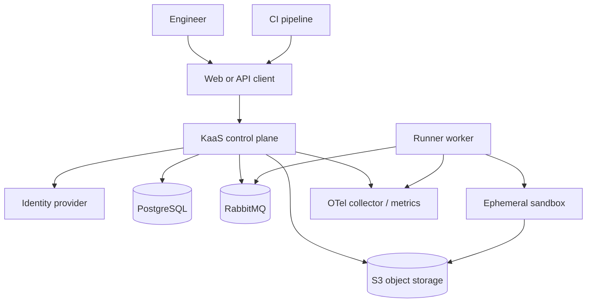

# System Context

**Status: PROPOSED PRODUCT CONTEXT.** Only the API, web, and runner scaffolds exist today. The runner now holds a container launcher that runs one trusted synthetic probe under a fixed security profile; it executes no user content.

The control plane is the trust boundary for configuration and orchestration. The sandbox is a lower-trust boundary, and is exercised today by a platform-owned workload rather than user-provided content. Worker contracts and sandbox enforcement are implemented — see [ADR-022](../adr/022-hostile-execution-boundary-and-synthetic-probe.md) and [ADR-024](../adr/024-synthetic-execution-lifecycle.md); credential isolation for tenant secrets is not, because no secret provider exists.
