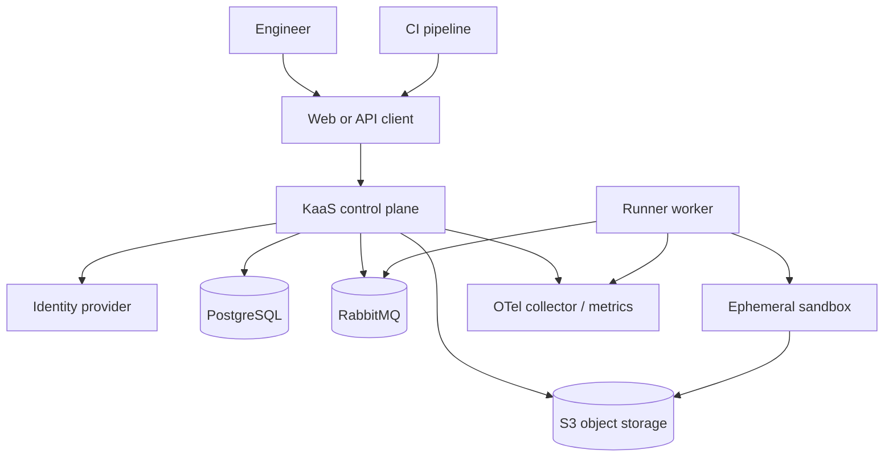

# System Context

**Status: PROPOSED PRODUCT CONTEXT.** Only the API, web, and runner scaffolds exist today. The runner now holds a container launcher that runs one trusted synthetic probe under a fixed security profile; it executes no user content.

The intended control plane is the trust boundary for configuration and orchestration. A future sandbox would be a lower-trust boundary for user-provided executable content. Worker contracts, credential isolation, and sandbox enforcement are not implemented.
