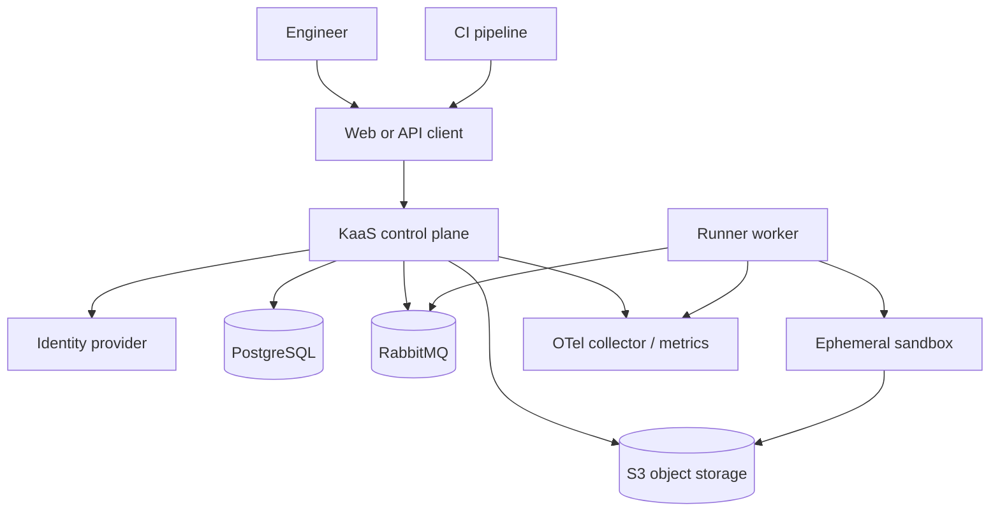

# System Context

The control plane is the trust boundary for configuration and orchestration. The sandbox is a lower-trust boundary for user-provided executable test content. Workers exchange only versioned contracts and never expose database credentials to the sandbox.
