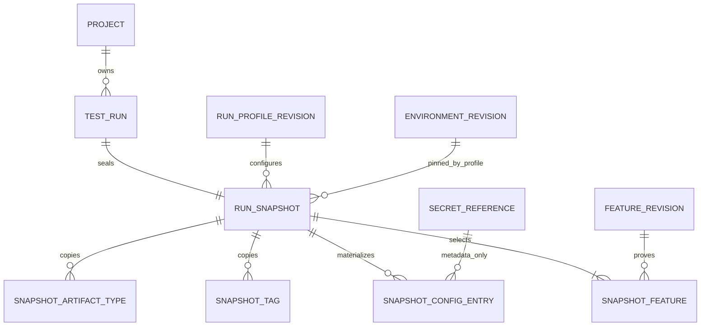

# Implemented TestRun intent and immutable RunSnapshot

**Status: IMPLEMENTED CONTROL-PLANE SLICE.** This document describes persistence and safe reads only. It does not claim scheduling or execution.

## Boundary

`POST /api/v1/projects/{projectId}/runs` accepts exact FeatureRevision IDs and one exact RunProfileRevision ID, commits a `CREATED` TestRun plus its sealed snapshot and idempotency record, then returns `202`. `GET /api/v1/runs/{runId}`, project run listing, and `GET /api/v1/runs/{runId}/snapshot` read only trusted organization-scoped persisted data.

No code in the slice publishes a message, creates an attempt, calculates a queue deadline, packages sources, redeems a secret, launches a process/container, runs Karate, uploads an artifact, or advances lifecycle state.

## Aggregate model

TestRun is lifecycle identity and concurrency state. RunSnapshot is immutable execution meaning. They share a one-to-one identity but have distinct responsibilities.

## Canonicalization

Feature request order is ignored. Materialized features sort by UTF-8 logical path, feature UUID, then revision UUID. Configuration sorts by key; tags and artifact types sort lexically. The versioned digest encodes explicit collection cardinalities and length-prefixed fields for project, exact revision provenance/digests, effective typed configuration, secret-reference UUID metadata, all profile settings, and server engine metadata. It excludes run ID and audit/lifecycle data so equivalent intent gets the same snapshot digest.

The idempotency fingerprint is separate. It covers project, exact profile revision ID, and sorted feature revision IDs only. Replay is checked before current server engine configuration or resource resolution and returns the original CREATED representation.

## Configuration and secret boundary

Environment plain values are copied, then profile plain overrides replace matching keys. Upstream RunProfile validation already prevents cross-type and secret overrides. Environment secret bindings remain `{key, secretReferenceId}`. The snapshot has no secret value/provider/path/capability columns and the read model exposes no SecretReference name.

## Persistence invariants

Migration V3 adds tenant-safe composite keys and normalized TestRun/snapshot tables. Initial TestRun insertion is guarded as version 1, CREATED, NOT_REQUESTED, null test/infrastructure outcomes, NOT_EVALUATED, equal creation/update audit, and no queue timing. Snapshot children can be inserted only before sealing. A deferred constraint trigger rejects commit without exactly one sealed snapshot whose digest matches the TestRun.

TestRun update/delete is fail-closed in this CREATED-only slice. A future lifecycle migration must replace that guard only when versioned transition handlers and their full orthogonal-state invariants are implemented. Snapshot headers and children cannot be changed or deleted after sealing. Foreign/mixed ownership cannot satisfy composite keys.

## Future command boundary

The snapshot can supply feature provenance, effective configuration, environment/profile provenance, selection, retry/timeout/parallelism/artifact settings, and engine metadata. It intentionally cannot yet supply command/message/attempt identity, assignment epoch, queue/execution deadlines, source-bundle location/capability/digest, runtime secret capabilities, or an enforced network-policy revision.

A future scheduler must create a separate immutable execution-attempt plan, resolve those missing controls, transition the run with a version compare-and-set, set queue timestamps/deadline, and write the outbox atomically. Until then, a CREATED run is deliberately not executable.
